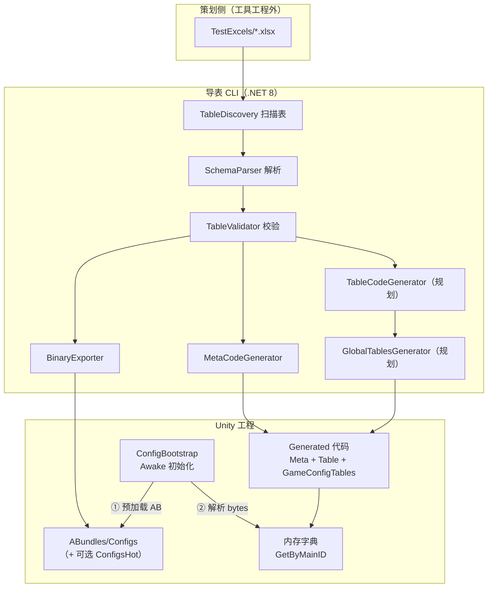
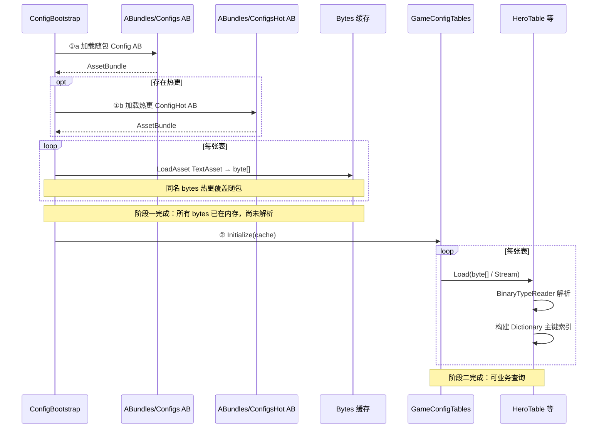

# ExcelTool4Unity 配置表方案报告

## 1. 背景与目标

### 1.1 背景

项目需要一套 Excel 配置表流水线，供策划在 Excel 中维护数据，程序在 Unity 运行时按主键高效查询。参考 Luban 等成熟方案的核心思路：**表结构代码化 + 数据二进制化 + 运行时内存索引**，同时保持工具轻量、可控。

### 1.2 目标

| 目标 | 说明 |
|---|---|
| 策划友好 | Excel 填表，约定行标记（`##var` / `##type` 等），文件名即表名 |
| 自动发现 | 新增/删除 xlsx 后重新导表即可，无需手写表清单 |
| 类型安全 | 导出前校验，生成强类型 C# 结构 |
| 运行时高效 | 启动时加载，内存字典按主键 O(1) 查询 |
| 工程解耦 | Excel 与导表工具在独立仓库/目录；Unity 只接收生成产物 |
| 可热更 | 数据走 AssetBundle，支持提前加载原始字节，再统一解析 |

### 1.3 非目标（当前阶段）

- 工具侧不实现完整 Unity 运行时框架（由 Unity 工程手写薄封装）
- 不做 ref / map / enum 自动生成等未要求能力
- 不做二进制格式版本升级（除非明确要求）

---

## 2. 总体架构



**核心原则：代码与数据分离**

- **代码**（`*Meta.cs`、`*Table.cs`、`GameConfigTables.cs`）→ 编译进程序集
- **数据**（`*.bytes`）→ 打进 AssetBundle，运行时先加载字节，再解析

---

## 3. 导表工具（ExcelTool）

### 3.1 当前已实现

| 模块 | 职责 | 状态 |
|---|---|---|
| `TableDiscovery` | `scanAll` 自动扫描 xlsx，支持 exclude/include | ✅ |
| `ExcelReader` + `SchemaParser` | 读取并解析表结构 | ✅ |
| `TableValidator` + `TypeConverter` | 校验并转强类型 | ✅ |
| `MetaCodeGenerator` | 生成 `{Name}Meta.cs` | ✅ |
| `BinaryExporter` + `BinaryTypeCodec` | 生成 `{Name}.bytes` | ✅ |
| `ExportPipeline` | 串联完整流水线 | ✅ |

**当前每张表产出 2 件：**

- `HeroMeta.cs` — 行数据结构
- `Hero.bytes` — 二进制数据

### 3.2 规划扩展（运行时查询所需）

| 模块 | 产出 | 作用 |
|---|---|---|
| `TableCodeGenerator` | `HeroTable.cs` | `Load` + `GetByMainID`，维护主键字典 |
| `GlobalTablesGenerator` | `GameConfigTables.cs` | 聚合所有表，提供 `Initialize` 入口 |
| `BinaryTypeReader`（共享运行时） | — | 已合并为 `BaseLayer.GameUtils.XtblBinaryReader`（手写） |

**扩展后每张表产出 3 件代码 + 1 件数据：**

```
HeroMeta.cs           → 行结构
HeroTable.cs          → 单表加载与查询
GameConfigTables.cs   → 全局入口（每轮导表重新生成，随表增删自动更新）
Hero.bytes            → 数据
```

### 3.3 配置方式

`export-config.json` 路径与 Unity 工程解耦，接入时直接指向 Unity 目录：

```json
{
  "excelRoot": "D:/Design/Excel",
  "codeOutput": "D:/MyGame/Assets/HotUpdateScripts/MetaConfigs/Metas",
  "globalOutput": "D:/MyGame/Assets/HotUpdateScripts/MetaConfigs",
  "dataOutput": "D:/MyGame/Assets/AssetBundle/ConfigTables",
  "namespace": "Game.Config",
  "tableDiscovery": "scanAll",
  "excludeTables": ["_Template"]
}
```

> Excel 源表始终不在 Unity 目录；Unity 保留 **HotUpdateScripts/MetaConfigs 代码** 与 **AssetBundle/ConfigTables 下 bytes 源资源**（由项目 AssetBundle Packer 打成 `configtables.bundle`）。

### 3.4 Excel 表格式

| A 列标记 | 说明 |
|---|---|
| `##var` | 字段名（第一列固定为 `id`，作主键） |
| `##type` | 字段类型 |
| `##Alias` | 中文别名 → XML 注释 |
| `##desc` | 字段说明 → XML 注释 |

- 文件名 = 表名：`Hero.xlsx` → `Hero`
- 数据从 `##desc` 下一行开始
- 数组单元格用 `|` 分隔，空单元格 = 空数组

### 3.5 支持类型

**标量：** `int` `uint` `long` `float` `double` `bool` `string`

**数组：** `int[]` `uint[]` `long[]` `float[]` `string[]` `bool[]`

### 3.6 二进制格式（XTBL v1）

| 偏移 | 内容 |
|---|---|
| 0 | Magic `"XTBL"`（4B） |
| 4 | Version `uint16 = 1` |
| 6 | RowCount `int32` |
| 10 | ColCount `byte` |
| 11 | ColTypes `ColCount × byte` |
| — | Rows 按列顺序序列化 |

**类型 ID：**

| ID | 类型 | 编码 |
|---|---|---|
| 1 | uint | 4 bytes |
| 2 | string | int32 长度 + UTF-8 |
| 3 | float | 4 bytes |
| 4 | int | 4 bytes |
| 5 | long | 8 bytes |
| 6 | double | 8 bytes |
| 7 | bool | 1 byte |
| 11 | int[] | int32 长度 + 各 int |
| 12 | uint[] | int32 长度 + 各 uint |
| 13 | float[] | int32 长度 + 各 float |
| 14 | string[] | int32 长度 + 各 string |
| 15 | long[] | int32 长度 + 各 long |
| 16 | bool[] | int32 长度 + 各 bool |

工具写入与 Unity 读取必须保持一致，详见 `.cursor/rules/exceltool-types.mdc`。

---

## 4. Unity 工程目录规划

### 4.1 代码与数据目录

```
Assets/
  HotUpdateScripts/
    MetaConfigs/                  ← globalOutput
      GameConfigTables.cs         ← 全局类，随导表自动更新
      Metas/                      ← codeOutput
        HeroMeta.cs
        HeroTable.cs
        ItemMeta.cs
        ItemTable.cs
  AssetBundle/
    ConfigTables/                 ← dataOutput（固定目录名）
      Hero.bytes
      Item.bytes
      ...
```

| 目录 | 内容 | 打包归属 | 是否可热更 |
|---|---|---|---|
| `HotUpdateScripts/MetaConfigs/` | C# 代码（Meta / Table / GameConfigTables） | 热更程序集 | **是**（表结构） |
| `AssetBundle/ConfigTables/` | 配置表 `.bytes` 源资源 | Default 规则 → `configtables.bundle` | 数据可 CDN 热更 |

**目录约定：**

- 所有表 bytes 统一导出到 **`Assets/AssetBundle/ConfigTables/`**（目录名固定）。
- AssetBundle Packer **Default** 规则下，该文件夹打成一个包：**`configtables.bundle`**。
- 运行时 loadPath 形如 `ConfigTables/Hero`（无扩展名）。

> 不按「每张表一个 AB」拆分。表数量再多，通常只占 **1 个 ConfigTables AB**，每张表是目录内的一个 `TextAsset`（`Hero.bytes` 等）。

### 4.2 AB 打包（vFramework AssetBundle Packer）

本项目 **不在 ExcelTool 内实现 AB 打包**；由 Unity 工程 **AssetBundle Packer**（`Assets/AssetBundle/` 首层子文件夹 + Default 规则）产出 bundle。

```
Assets/AssetBundle/
  ConfigTables/    → configtables.bundle（Default 首层子文件夹规则）
  Atlas/           → atlas.bundle
  ...
```

打包侧职责（与配置表方案的关系）：

| 职责 | 说明 |
|---|---|
| 固定目录 | bytes 仅写入 `AssetBundle/ConfigTables/` |
| 产出 AB | `configtables.bundle`，bundle 名 = 文件夹名小写 + `.bundle` |
| 热更清单 | CDN 版本由 BaseAssetSys 维护，配置模块只消费 catalogue / 已加载 bundle |

导表工具职责边界：

- 只负责把 `*.bytes` 写到 `dataOutput` 指向的 `AssetBundle/ConfigTables/`
- 不关心 catalog 如何写、CDN URL 是什么

---

## 5. 运行时方案：AB 预加载 → 再解析

这是本方案在 Unity 侧的核心设计，分 **两阶段**，避免在 `Awake` 里同步读盘+解析阻塞主线程过久，也为热更留出空间。

### 5.1 为什么用 AB 存数据

| 对比项 | StreamingAssets | AssetBundle |
|---|---|---|
| 热更 | 需整包更新 | **支持 CDN 替换 AB** |
| 与代码关系 | 原样拷贝进包 | 独立资源包，版本可分离 |
| 加载方式 | `File.OpenRead`（Android 有坑） | `AssetBundle.LoadAsset<TextAsset>` 统一 |
| 分包/按需 | 弱 | **可按模块拆 AB** |
| 复杂度 | 低 | 中等 |

**结论：** 数据类配置表走 **AB 包**（`ABundles/Configs` 等目录打出）；代码（Meta/Table/Global）随版本编译。表结构变更发版，表数据变更可只更热更 AB。

### 5.2 两阶段加载流程



**阶段一：预加载（Preload）**

- 从 `ABundles/Configs` 对应的随包 AB 加载全部 `TextAsset`（`*.bytes`）
- 若启用热更，再加载 `ABundles/ConfigsHot` 对应 AB；**同名文件以热更目录为准**
- 仅缓存 `byte[]`，**不做反序列化**
- 可 `async` 并行加载，显示 Loading 进度
- 实际 AB 路径 / CDN URL 由项目资源系统解析，配置模块只接收已加载的 `AssetBundle`

**阶段二：解析（Parse）**

- 调用 `GameConfigTables.Initialize(preloadedData)`
- 各 `XxxTable.Load(stream)` 读取 XTBL 头、按列类型反序列化
- 以第一列 `id` 为键写入 `Dictionary<主键类型, XxxMeta>`
- 解析完成后释放原始 `byte[]` 缓存（可选，省内存）

### 5.3 生成代码接口设计（规划）

```csharp
// 单表：支持文件路径（Editor 调试）与内存流（AB 正式路径）
public sealed class HeroTable
{
    readonly Dictionary<uint, HeroMeta> _byMainId = new();

    public void Load(string filePath) { ... }
    public void Load(byte[] data) => Load(new MemoryStream(data));
    public void Load(Stream stream) { /* BinaryTypeReader 解析 */ }

    public HeroMeta GetByMainID(uint id) => _byMainId[id];
    public bool TryGetByMainID(uint id, out HeroMeta row) => _byMainId.TryGetValue(id, out row);
}

// 全局：聚合 + 初始化
public sealed class GameConfigTables
{
    public static GameConfigTables Instance { get; private set; }

    public HeroTable Hero { get; } = new();
    public ItemTable Item { get; } = new();

    // 阶段二入口：传入预加载好的 bytes 字典
    public static void Initialize(IReadOnlyDictionary<string, byte[]> tableBytes)
    {
        var t = new GameConfigTables();
        t.Hero.Load(tableBytes["Hero.bytes"]);
        t.Item.Load(tableBytes["Item.bytes"]);
        Instance = t;
    }
}
```

### 5.4 Unity 启动注册（ConfigTableModule）

由 `GameRoot.TryStart` → `GameBootstrap` 注册 `ConfigTableModule`（Priority 120），在 `Init` 中：

1. `ConfigTableBytesLoader` 从 `configtables.bundle` 预加载全部 bytes（Editor 可回退直读 `AssetBundle/ConfigTables/`）
2. `ConfigTableInitRegistry` 回调 → `GameConfigTables.Initialize(cache)`
3. 注册 `IConfigTableService`

导表生成的 `GameConfigTables.RegisterToFramework` 在 SubsystemRegistration 阶段注册 `Initialize`，避免 BaseLayer 与 HotUpdateScripts 循环引用。未导表时不生成该类，工程仍可编译，`GameBootstrap` 跳过配置表 Module。

### 5.5 业务调用

```csharp
// 按主键查询
var hero = GameConfigTables.Instance.Hero.GetByMainID(10000u);
string name = hero.Name;
int[] rewards = hero.Rewards;

// 另一张表
var item = GameConfigTables.Instance.Item.GetByMainID(20001u);
```

查询发生在**解析完成之后**；解析前访问应返回明确错误或未初始化状态。

---

## 6. 数据流全链路

```
策划 Excel（工具工程外）
    ↓ export.bat
导表 CLI：校验 → 生成 Meta/Table/Global → 导出 bytes
    ↓
Unity Config/Generated/（代码，进 DLL）
Unity ABundles/Configs/（及可选 ConfigsHot/，bytes 源资源）
    ↓ 项目自定义 AB 打包（按 ABundles 子文件夹选策略）
随包 AB（Configs） + 可选热更 AB（ConfigsHot / CDN）
    ↓ 游戏启动
① 加载 AB → 预加载全部 TextAsset → byte[] 缓存（热更覆盖随包）
② GameConfigTables.Initialize → 解析 + 建索引
    ↓
业务 GetByMainID(id) → Meta 字段
```

---

## 7. 与 Luban 对照

| 能力 | Luban | 本方案 |
|---|---|---|
| 表结构代码 | `Bean` 定义 | `*Meta.cs` |
| 表访问类 | `TbHero` | `HeroTable` |
| 全局入口 | `Tables` | `GameConfigTables` |
| 按主键查 | `Get(key)` | `GetByMainID(id)` |
| 数据格式 | 自定义二进制 | XTBL v1 |
| 数据分发 | 多模式（含 AB） | **ABundles/Configs（+ 热更）+ 预加载** |
| 工具复杂度 | 高 | 轻量 CLI，按需扩展 |

---

## 8. 仓库目录约定（工具工程）

```
ExcelTool4UnityGame/
├── TestExcels/              # 输入：Excel 源表（gitignore）
├── TargetFonder/            # 输出：本地测试目录
│   ├── Metas/               #   生成的 *Meta.cs
│   └── Codes/               #   生成的 *.bytes
├── ExcelTool/               # 导表 CLI
│   ├── export-config.json
│   ├── export.bat
│   └── ExcelTool/           # 源码
├── Learn/                   # 学习材料
└── 配置表方案报告.md         # 本文档
```

---

## 9. 实施计划

### 9.1 已完成

- [x] Excel 解析、校验、类型系统
- [x] `*Meta.cs` 代码生成
- [x] `*.bytes` 二进制导出
- [x] `scanAll` 自动发现表
- [x] 路径可配置，与 Unity 目录解耦

### 9.2 待实现（工具侧）

- [x] 运行时读取对齐 `XtblBinaryReader`（不再生成 BinaryTypeReader）
- [x] `TableCodeGenerator`（`Load` + `GetByMainID`）
- [x] `GlobalTablesGenerator`（`GameConfigTables`）
- [x] `ExportPipeline` 收集全表后生成全局类
- [ ] `export-config.json` 增加 `tablesOutput`
- [ ] 文档与 gitignore 同步

### 9.3 待实现（Unity 侧，手写）

- [ ] `ConfigTableModule` + `ConfigTableBytesLoader`（已实现，见 ConfigTableLayer）
- [ ] 与 AssetBundle Packer Default 规则对齐：`AssetBundle/ConfigTables` → `configtables.bundle`
- [ ] 热更 AB 与随包 AB 的加载顺序及同名 `bytes` 覆盖规则
- [ ] （可选）热更 AB 下载与版本校验（走项目资源热更系统）
- [ ] （可选）加载进度 / 失败重试

### 9.4 里程碑建议

| 阶段 | 交付物 |
|---|---|
| M1 | Table + Global 代码生成，Editor 下 `File` 直读验证 |
| M2 | AB 打包 + 预加载 + 内存解析打通 |
| M3 | 热更 AB 替换与版本对齐策略 |

---

## 10. 风险与对策

| 风险 | 对策 |
|---|---|
| 工具编码与 Unity 解码不一致 | 类型 ID 固定文档化；`BinaryTypeReader` 与 `BinaryTypeCodec` 对称维护 |
| 表增删后残留旧文件 | 导表覆盖生成；定期清理 `ABundles/Configs`；全局类每轮全量重生 |
| AB 与代码版本不匹配 | 表结构变更随 App 版本；仅数据变更走 AB 热更；可加 magic/version 校验 |
| 启动耗时 | 阶段一可异步；大表可考虑分 AB 懒加载（后续扩展） |
| 主键重复 | 导表阶段 `TableValidator` 校验唯一性（待加） |

---

## 11. 结论

本方案采用 **「工具导表 → 代码与数据分离 → AB 存数据 → 预加载后解析 → 全局类按主键查询」** 的架构：

1. **策划**在工具工程外维护 Excel，Unity 不存放源表。
2. **导表工具**自动生成 Meta、Table、全局 `GameConfigTables` 及 bytes，表增删时全局类自动更新。
3. **Unity 运行时**将 bytes 置于 `ABundles/Configs`（及可选 `ConfigsHot`），由自定义打包打成 1～2 个 Config AB；启动时 **先预加载全部 bytes 到内存，再统一解析** 构建主键索引。
4. **业务层**通过 `GameConfigTables.Instance.Xxx.GetByMainID(id)` 访问，注册时仅在 `Awake` 走一遍初始化流程。

该方案在保持工具轻量的同时，具备 Luban 类表的核心体验，并明确支持 **AB 热更数据** 与 **加载/解析两阶段** 的运行时模型，可作为后续开发与评审的依据。
