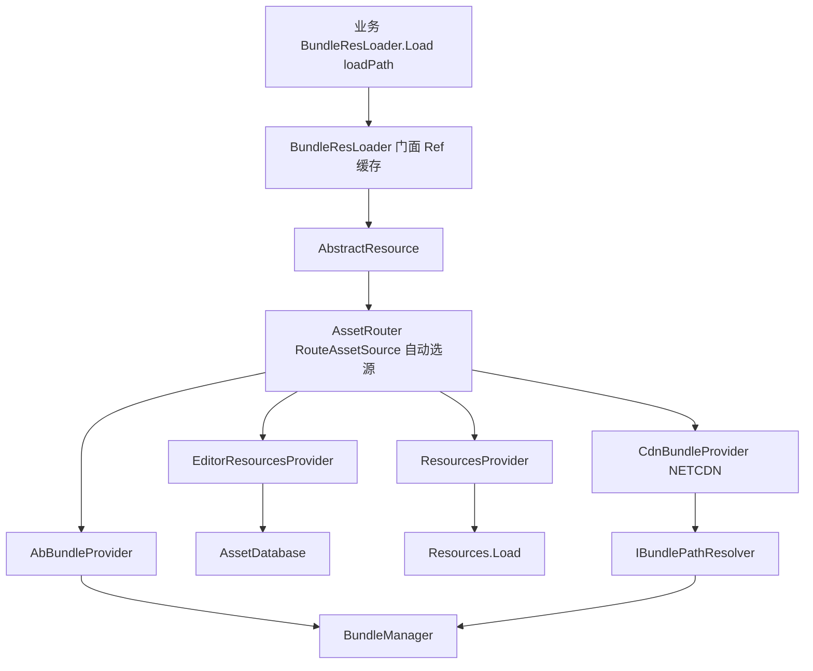

# ResLoader 模块说明

> 路径：`BaseAssetSys/ResLoader/`  
> 运行时加载侧；与打包侧 `Editor/` + `BundleRuleConfig/` 通过 **清单 JSON** 衔接。

---

## 加载侧架构图（业务无感知）



| 层 | 对业务可见 | 职责 |
|----|------------|------|
| `BundleResLoader` | 是 | 唯一入口；Catalogue 查表；`IAssetHandle`；Ref |
| `AssetRouter` | **否** | 根据 path / Catalogue / 环境 **自动** `RouteAssetSource` |
| `IAssetProvider` | 否 | 各来源 Load / Release 实现 |

业务始终：`BundleResLoader.Instance.Load<T>("path")`，**不**直接选 `AssetSource` 或 NETCDN。

---

## 分层与子目录

```text
业务代码
    ▼
Business/          BundleResLoader     业务 API、Resource 缓存、懒 Init
    ▼
AbstractAssets/    AbstractResource    Resource 层 Ref（模块外，见同级目录）
    ▼
Router/            AssetRouter         四源路由 + Provider
    ├─ ABUNDLE / RESOURCES / EDITORRESOURCES / NETCDN
    ▼
Bundle/            BundleManager       .bundle 容器、依赖 Acquire、路径解析
Catalogue/         CatalogueReader     读清单 entries / bundles[]
```

| 目录 | 文件 | 职责 |
|------|------|------|
| `Business/` | `BundleResLoader.cs` | 单例入口：`Load` / `LoadUniTaskAsync` / `UnloadAll` |
| `Bundle/` | `BundleManager.cs` | Bundle Ref、`AcquireBundleWithDependencies` |
| `Bundle/` | `IBundlePathResolver.cs` | 本地多根（cache → 首包）；`StubRemoteBundleProvider` |
| `Catalogue/` | `CatalogueReader.cs` | 运行时读 `AssetCatalog.json`；Editor 可回退工程内副本 |
| `Catalogue/` | `StreamingAssetsIO.cs` | Android `jar:` 等 StreamingAssets 读文件 |
| `Router/` | `AssetRouter.cs` | `RouteAssetSource` + `Load` / `Release` |
| `Router/` | `IAssetProvider.cs` | `AssetSource` 枚举与 Provider 接口 |
| `Router/` | `*AssetProvider.cs` | 四源具体实现 |
| `Router/` | `BundleAssetLoadHelper.cs` | AB / CDN Provider 共用 LoadAsset 逻辑 |

---

## AssetRouter 路由（业务无感）

| 源 | 条件 |
|----|------|
| `RESOURCES` | `loadPath` 以 `Resources/` 开头 |
| `EDITORRESOURCES` | Editor Play 且 Catalogue `buildMode == EditorTest` |
| `NETCDN` | 非 EditorTest 且本地无 bundle（`IBundlePathResolver`） |
| `ABUNDLE` | 默认 |

`DeviceDebug` / 首包仍走真 AB；`EditorTest` 走 AssetDatabase。

---

## 与打包侧的边界

| 打包侧产出 | 加载侧消费 |
|------------|------------|
| `{bundleRoot}/*.bundle` | `BundleManager.AcquireBundle` |
| `{bundleRoot}/Catalogue/AssetCatalog.json` | `CatalogueReader.LoadFromBundleRoot` |
| `BundleRuleConfig/Catalogue/AssetCatalog.json` | Editor 无 StreamingAssets 时 `LoadFromProjectCatalogue` |
| `buildMode` 写入清单 | `AssetRouter` 决定是否 Editor 模拟 |

路径工具 `BundlePlatformPaths` 在 **`BundleRuleConfig/`**（构建与运行时共用）。

---

## 详细设计

[LoaderDesignGuide.md](./LoaderDesignGuide.md)

## 相关文档

- [Docs/MainRoadmap.md](../Docs/MainRoadmap.md)
- [Docs/BusinessApiAndCdnPlanning.md](../Docs/BusinessApiAndCdnPlanning.md)
- [AbstractAssets/README.md](../AbstractAssets/README.md)
