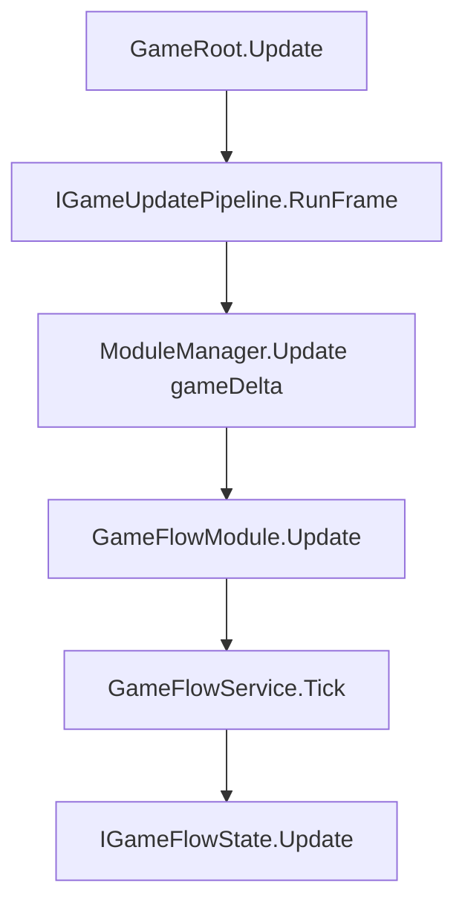

# GameFlow API 参考

> 路径：`BaseFramework/BaseGameRoot/GameFlow/`  
> 命名空间：`BaseFramework.BaseGameRoot`  
> 父模块：[BaseGameRoot/README.md](../README.md)（GameRoot / TryStart / Module 调度）

GameFlow 表示并驱动**整局游戏的宏观运行阶段**（Boot、主菜单、战斗等），对标 Unity Game Framework **Procedure**、TEngine **ProcedureModule**。须在 Bootstrap 中注册 **`GameFlowModule`** 后，业务通过 `IGameFlowService` 查询与切换状态。

**不是**通用 FSM 内核（规划中的 `BaseFSM`）；**不是** `MonoBehaviour`；**不是**局内回合/技能等细粒度状态。

---

## 1. 设计思想

### 1.1 解决什么问题

| 需求 | GameFlow 做法 |
|------|----------------|
| 游戏「现在在哪个阶段」 | `IGameFlowService.CurrentStateId` |
| 阶段切换编排（Patch → 大厅 → 战斗） | `IGameFlowState` + `ChangeState` |
| 切换可观测 / 可记录 | `PreviousStateId`、`CurrentStateElapsedSeconds`、`GameFlowChangedEvent` |
| 与 GameRoot 单 Update 链一致 | `GameFlowModule : IGameModule`，无第二套 Mono Tick |

### 1.2 与业界对照

| 概念 | Game Framework | TEngine | vFramework |
|------|----------------|---------|------------|
| 宏观流程 | ProcedureManager | ProcedureModule | **GameFlowModule + IGameFlowService** |
| 单态生命周期 | OnEnter / OnUpdate / OnLeave | 同左 | **Enter / Update / Exit** |
| 热更入口 | — | GameApp.Entrance | **GameRoot.TryStart** 后 Bootstrap 注册状态 |
| 通用 FSM（AI 等） | FsmManager | FsmModule | **BaseFSM**（未实现，与 GameFlow 独立） |

### 1.3 刻意不做的

- **不**继承 `MonoBehaviour`；由 `ModuleManager.Update` 驱动。
- **不**在框架层内置业务 Procedure；`IGameFlowState` 由 Bootstrap / 热更层 `Register`（示例见 `HotUpdateBootStrap/FlowStates/`）。
- **不**用 GameFlow 表达局内每一回合/关卡细节；局内用嵌套 FSM 或 ECS + Module `_active`。
- **不**在 Update 热路径 `services.Get`；状态在 `Enter` 缓存依赖。

### 1.4 与 Module 启停的分工

```text
GameFlow（宏观）     →  ChangeState(InBattle)  →  Procedure 内 BattleEcsModule.Activate()
Module._active（域内） →  仅控制该 Module 是否 Tick，不定义全局阶段名
```

---

## 2. 快速接入

### 2.1 Bootstrap 注册（可选 Module）

`GameFlowModule` 为**可选**；不需要宏观流程的项目可不 `AddModule`。

```csharp
public void Configure(IServiceRegistry services, IModuleRegistry modules)
{
    modules.AddModule(new GameTimeModule()); // 可选；无则 GameRoot 用 Unity deltaTime

    modules.AddModule(new GameFlowModule(
        registerStates: reg =>
        {
            reg.Register(new BootFlowState());      // Bootstrap / 热更层实现
            reg.Register(new MainMenuFlowState());
            reg.Register(new ProcedureBattle());    // 业务 Procedure
        },
        initialStateId: GameFlowIds.Boot));

    modules.AddModule(new DebugCommandModule(reg =>
        GameFlowModule.RegisterDebugCommands(reg)));
}
```

`initialStateId` 为 `null` 时不自动切换；由业务在 `InitAll` 之后手动 `services.Get<IGameFlowService>().ChangeState(...)`。

### 2.2 Module 内缓存

```csharp
private IGameFlowService _flow;

public void Init(IServiceRegistry services)
{
    _flow = services.Get<IGameFlowService>();
}

public void OnStartBattleClicked()
{
    _flow.ChangeState("Battle", userData: "Scene_Battle_01");
}
```

---

## 3. 架构与帧顺序



| 顺序 | Priority | 模块 | 说明 |
|------|----------|------|------|
| 1 | 0 | Input | 输入快照 |
| 2 | 100 | GameTime | Clock / Pipeline |
| 3 | **150** | **GameFlow** | 宏观流程 Tick |
| 4 | 600 | GameLogic | 战斗 ECS 等 |
| 5 | 1000 | UI | 界面 |

GameFlow 使用 **gameDelta**（与 `ModuleManager` 一致），状态内异步加载请在 `Enter` 启 UniTask、`Update` 轮询完成标志后再 `ChangeState`。

---

## 4. 核心接口

### 4.1 IGameFlowService（运行时查询与切换）

| 成员 | 类型 | 说明 |
|------|------|------|
| `CurrentStateId` | `string` | 当前状态 Id；未切换过为 `null` |
| `PreviousStateId` | `string` | 上一状态 Id |
| `CurrentStateElapsedSeconds` | `float` | 当前态持续时长（`realtimeSinceStartup`，不受 TimeScale 影响） |
| `IsInState(stateId)` | `bool` | 是否处于指定 Id |
| `ChangeState(stateId, userData)` | `void` | 切到已注册状态；**同 Id 为 no-op**（不重复 Enter） |

未知 `stateId`：`LogError`，不抛异常（便于调试命令容错）。

### 4.2 IGameFlowState（热更层实现）

| 成员 | 说明 |
|------|------|
| `Id` | 唯一字符串，建议用 `GameFlowIds` 或业务常量类 |
| `Enter(context)` | 进态：开 UI、订阅事件、Activate Module、启动异步 |
| `Update(deltaTime, context)` | 每帧：等加载、超时、子步骤；可留空 |
| `Exit(context)` | 出态：与 Enter 对称，退订 / 关 UI / Deactivate |

### 4.3 IGameFlowContext（状态内上下文）

| 成员 | 说明 |
|------|------|
| `Services` | `IServiceRegistry`；Enter 时 `Get` / `TryGet` 并缓存 |
| `Flow` | 同 `IGameFlowService`；状态内切换用 `Flow.ChangeState` |
| `UserData` | 本次 `ChangeState` 传入的附加参数（如场景名） |

### 4.4 IGameFlowRegistry（仅 Configure 阶段）

| 方法 | 说明 |
|------|------|
| `Register(state)` | 注册状态；重复 Id 抛 `ArgumentException` |
| `Contains(stateId)` | 是否已注册 |

仅在 `GameFlowModule.Init` 的 `registerStates` 回调中使用。

### 4.5 GameFlowIds（内置 Id 常量）

| 常量 | 值 | 含义 |
|------|-----|------|
| `Boot` | `"Boot"` | 启动 / Patch / 热更占位 |
| `MainMenu` | `"MainMenu"` | 主菜单 / 大厅 |

热更层新增 Id 时：在本类或业务 `FlowIds` 中定义常量，避免魔法字符串。

---

## 5. 新增状态（三步）

1. **定义 Id** — 在 `GameFlowIds` 或热更常量类增加 `public const string Battle = "Battle";`
2. **实现状态** — 参考 `States/MainMenuFlowState.cs`：

```csharp
public sealed class ProcedureBattle : IGameFlowState
{
    public string Id => "Battle";

    public void Enter(IGameFlowContext context)
    {
        // context.Services.Get<BattleEcsModule>()?.Activate();
    }

    public void Update(float deltaTime, IGameFlowContext context) { }

    public void Exit(IGameFlowContext context)
    {
        // Deactivate battle module
    }
}
```

3. **注册** — 在 `GameFlowModule` 构造函数 `registerStates` 中 `reg.Register(new ProcedureBattle())`

切换时传参：

```csharp
context.Flow.ChangeState("Loading", userData: "Scene_Level_01");
// Enter 内：var scene = (string)context.UserData;
```

---

## 6. 事件与记录

### 6.1 GameFlowChangedEvent

每次成功切换后，经 `GameEventBus.SentEvent` 发布：

| 字段 | 说明 |
|------|------|
| `FromStateId` | 离开的状态（首次为 `null`） |
| `ToStateId` | 进入的状态 |
| `UserData` | 本次切换附带参数 |

```csharp
GameEventBus.RegisterEvent<GameFlowChangedEvent>(e =>
{
    Debug.Log($"Flow: {e.FromStateId} -> {e.ToStateId}");
});
```

### 6.2 存档

宏观流程 Id 可由 `ISaveDataCollector` 读取 `IGameFlowService.CurrentStateId` 写入 payload；**不必**序列化整个状态机内部表。

---

## 7. 调试命令

在 `DebugCommandModule` 中调用 `GameFlowModule.RegisterDebugCommands(reg)`：

| 命令 | 说明 |
|------|------|
| `flow.state` | 输出 Current / Previous / Elapsed |
| `flow.goto <stateId>` | Development 下强制切换 |

---

## 8. GameFlowModule API

| 成员 | 说明 |
|------|------|
| `Priority` | `ModulePriority.GameFlow`（150） |
| `RegisterDebugCommands(registry)` | 注册 flow.state / flow.goto |
| 构造函数 `(registerStates, initialStateId)` | Bootstrap 注册 Procedure 与首态 |

---

## 9. 常见问题

**Q：ChangeState 同 Id 为什么没反应？**  
A：故意 no-op，避免重复 Enter 导致 UI 叠层。需「重进」时先切到其他态再切回。

**Q：Boot 里 TryStart 和 GameFlow 谁先？**  
A：`TryStart` → `InitAll` → `GameFlowModule.Init` → 若设了 `initialStateId` 则 `ChangeState`。热更 DLL 加载应在 Boot 态异步完成后再切 MainMenu。

**Q：和 BaseFSM 关系？**  
A：GameFlow 是**游戏专用**单当前态调度；BaseFSM 将来供 AI / UI 子状态等多实例场景，**不替代** GameFlow，也**不必**先进 Module Update。

---

## 相关文档

| 文档 | 范围 |
|------|------|
| [BaseGameRoot/README.md](../README.md) | GameRoot / IOC / Module 总览 |
| [GameTime/GameTimeApi.md](../GameTime/GameTimeApi.md) | 时钟 / Timer / Facade |
| [FrameworkDesign.md](../../../Docs/Overview/FrameworkDesign.md) | 三层架构与 GameFlow 定位 |
| [StandaloneAndResourceHotfixGuide.md](../../../Docs/Guides/StandaloneAndResourceHotfixGuide.md) | 单机接入与 Mono 迁移 |
