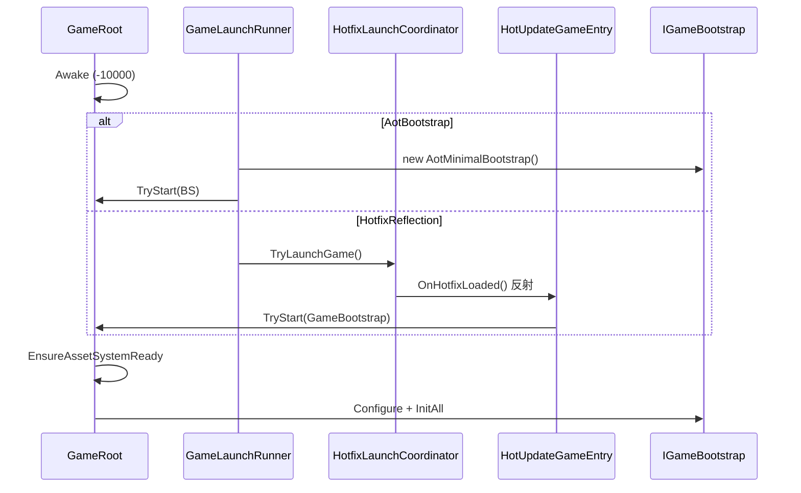

# GameLaunch 启动协调

> 路径：`BaseFramework/BaseGameRoot/GameLaunch/`  
> 命名空间：`BaseFramework.BaseGameRoot`  
> 父模块：[BaseGameRoot/README.md](../README.md)（GameRoot / TryStart / Module 调度）

GameLaunch 负责 **Bootstrap 场景里「何时、以何种方式调用 `GameRoot.TryStart`」**。  
它把 **AOT 框架启动** 与 **可选 HybridCLR 热更入口** 从 `GameRoot` 本体中拆出，避免 AOT 程序集硬引用热更 Bootstrap 类型。

**不是** HybridCLR DLL 下载/加载器（那是 Launcher / Patch 层职责）；**不是** 宏观游戏流程（那是 `GameFlowModule`，在 `TryStart` **之后** 才运行）。

---

## 1. 设计思想

### 1.1 解决什么问题

| 需求 | GameLaunch 做法 |
|------|-----------------|
| Bootstrap Scene 零 Inspector 拖引用 | 代码里 `TryStart(IGameBootstrap)` 或 `GameLaunchRunner` 枚举选择模式 |
| 无热更项目也能跑通框架 | 默认 `AotBootstrap` → `AotMinimalBootstrap`，无反射、无 DLL |
| 启用热更时 AOT 不引用热更类型 | `HotfixLaunchCoordinator` 反射一次解析 `HotUpdateGameEntry`，`MethodInfo` 缓存 |
| 避免 Awake 竞态 | `GameRoot`（-10000）先于 `GameLaunchRunner`（-9999）Awake；`Start` 延后一帧检查 |
| 外部 Launcher 自定义启动时机 | `autoLaunchOnAwake = false`，由 Patch/测试脚本自行 `TryStart` |

### 1.2 与 GameRoot / GameFlow 的分工

```text
GameLaunch（本目录）     →  调用 TryStart，选定 IGameBootstrap 实例
GameRoot                 →  EnsureAssetSystemReady → Configure → InitAll → Update 调度
GameFlow（TryStart 之后）→  Boot / MainMenu 等宏观 Procedure（见 GameFlow/GameFlowApi.md）
HybridCLR Patch          →  下载/加载 DLL（在 TryLaunchGame 之前，不由本目录实现）
```

`BootFlowState` 注释中的「Boot」指 **TryStart 完成后的首屏编排**，与 GameLaunch 的「启动管道」不是同一层。

### 1.3 刻意不做的

- **不**在 Inspector 绑定 `IGameBootstrap` 引用（与 BaseGameRoot 整体约定一致）。
- **不**实现 HybridCLR `LoadAssembly`；只假设热更程序集**已加载**后再调 `TryLaunchGame`。
- **不**注册业务 Module；装配内容在 `IGameBootstrap.Configure`（`AotMinimalBootstrap` 或热更 `GameBootstrap`）。
- **不**替代 `GameRoot` 的 Asset 预热；`TryStart` 成功路径仍走 `EnsureAssetSystemReady`。

---

## 2. 启动时序

### 2.1 AOT 直启（默认，无 HybridCLR）

```text
Bootstrap Scene：GameObject 挂 GameRoot + GameLaunchRunner

GameRoot.Awake              (-10000)
    → DontDestroyOnLoad
    → Registry 无 Bootstrap → _waitingBootstrap = true

GameLaunchRunner.Awake      (-9999, autoLaunchOnAwake = true, launchMode = AotBootstrap)
    → GameRoot.TryStart(new AotMinimalBootstrap())
        → GameBootstrapRegistry.Register
        → StartPipeline
            → EnsureAssetSystemReady（BundleResLoader / catalog.bytes）
            → Configure（AotMinimalBootstrap：GameTimeModule 等）
            → InitAll

GameRoot.Start（若仍 waiting）
    → yield null → 已启动则跳过；否则 LogError 并 enabled = false
```

### 2.2 HybridCLR 热更路径（可选）

```text
GameRoot.Awake              → waitingBootstrap

[外部 Launcher] LoadAssembly / Patch 完成

GameLaunchRunner.Awake (HotfixReflection)
    或 Launcher 直接调用 HotfixLaunchCoordinator.TryLaunchGame()
    → 反射 HotUpdateGameEntry.OnHotfixLoaded()（MethodInfo 仅解析一次）
    → GameRoot.TryStart(new GameBootstrap())
    → StartPipeline（热更 Bootstrap 注册 ConfigTable / GameFlow / 业务 Module）
```



### 2.3 执行顺序与 Registry

| 顺序 | 组件 | 说明 |
|------|------|------|
| 1 | `GameRoot` Awake | `DefaultExecutionOrder(-10000)` |
| 2 | `GameLaunchRunner` Awake | `DefaultExecutionOrder(-9999)` |
| 3 | `GameRoot.Start` | 延后一帧检查 Bootstrap 是否已注入 |

`TryStart` 在 `GameRoot.Instance == null` 时仅 **Register** 到 `GameBootstrapRegistry`；Instance Awake 后会 `TryGet` 并 `StartPipeline`。  
因此 **先 TryStart、后 GameRoot Awake** 的顺序也合法（少见，多用于纯代码测试）。

---

## 3. 组件说明

| 类型 | 文件 | 职责 |
|------|------|------|
| `GameLaunchRunner` | `GameLaunchRunner.cs` | 可选 Mono；Awake 时按 `launchMode` 触发启动 |
| `GameLaunchMode` | `GameLaunchMode.cs` | `AotBootstrap` / `HotfixReflection` |
| `HotfixLaunchCoordinator` | `HotfixLaunchCoordinator.cs` | 反射热更入口；幂等 `TryLaunchGame` |
| `AotMinimalBootstrap` | `../Bootstrap/AotMinimalBootstrap.cs` | 无热更时的最小 `IGameBootstrap` |
| `HotUpdateGameEntry` | `BaseLayer/HotUpdateBootStrap/`（过渡，目标迁入热更程序集） | 热更侧 `OnHotfixLoaded` → `TryStart(GameBootstrap)` |

### 3.1 GameLaunchRunner Inspector

| 字段 | 默认 | 说明 |
|------|------|------|
| `autoLaunchOnAwake` | `true` | 关闭后由外部 Launcher / 测试脚本调用 `TryStart` 或 `TryLaunchGame` |
| `launchMode` | `AotBootstrap` | 启用 HybridCLR 时改为 `HotfixReflection`，或由 Launcher 直接调协调器 |

### 3.2 HotfixLaunchCoordinator 约定

| 常量 | 默认值 |
|------|--------|
| `HotfixEntryTypeName` | `BaseFramework.BaseGameRoot.HotUpdateBootStrap.HotUpdateGameEntry` |
| `HotfixEntryMethodName` | `OnHotfixLoaded` |

热更程序集迁入 `HotUpdateScripts/` 后，**保持类型全名与方法签名一致**，或修改 AOT 侧上述常量。  
入口方法须为 **public static**，返回 `bool`（表示 `TryStart` 是否成功）；无返回值时视为成功。

---

## 4. 如何使用

### 4.1 场景挂载（推荐）

1. Bootstrap Scene（如 `Init.unity`）创建唯一 GameObject，挂 **GameRoot**。
2. 同物体挂 **GameLaunchRunner**（或单独物体，不影响顺序）。
3. 无热更：保持 `launchMode = AotBootstrap`，`autoLaunchOnAwake = true`。
4. **不要**在 Inspector 拖 `IGameBootstrap` 引用。

### 4.2 三种典型模式

| 场景 | 配置 / 调用 |
|------|-------------|
| 单机 / 无 HybridCLR | `GameLaunchRunner` → **AotBootstrap**；或任意处 `GameRoot.TryStart(new AotMinimalBootstrap())` |
| Editor 模拟热更 | `launchMode = HotfixReflection`（需热更程序集已在域内）；或代码 `HotfixLaunchCoordinator.TryLaunchGame()` |
| 正式 HybridCLR | Patch Launcher：`LoadAssembly` 完成 → `HotfixLaunchCoordinator.TryLaunchGame()`；Runner 可关 `autoLaunchOnAwake` 避免重复 |

### 4.3 自定义 Bootstrap（测试 / Demo / 专项验证）

当需要 **非** `AotMinimalBootstrap` / 默认 `GameBootstrap` 的装配（例如只注册 `SceneModule`、ConfigTest）：

1. `GameLaunchRunner.autoLaunchOnAwake = false`（项目 `Init.unity` 已采用此配置）。
2. 在 **更晚 Awake** 的 Mono、或 Patch 完成后，调用：

```csharp
GameRoot.TryStart(new MyCustomBootstrap());
```

3. 确保在 `GameRoot.Start` 的「延后一帧检查」之前完成调用，否则会 LogError 并禁用 GameRoot。

自定义 Bootstrap 仍实现 `IGameBootstrap.Configure`，在内部 `Register` Service、`AddModule`（参见 [BaseGameRoot/README.md §4](../README.md)）。

### 4.4 热更 Bootstrap 模板

启用热更时的完整装配示例见过渡目录 `BaseLayer/HotUpdateBootStrap/GameBootstrap.cs`（ConfigTable、GameFlow、业务 Module）。  
目标迁入 `HotUpdateScripts/` 后，AOT 仅保留 `HotfixLaunchCoordinator` + `GameLaunchRunner`。

---

## 5. API 速查

### GameLaunchRunner

| 成员 | 说明 |
|------|------|
| `autoLaunchOnAwake` | Awake 是否自动启动 |
| `launchMode` | `AotBootstrap` / `HotfixReflection` |

### HotfixLaunchCoordinator

| 方法 | 说明 |
|------|------|
| `TryLaunchGame()` | 反射调用热更入口；已 `IsStarted` 时直接返回 `true`（幂等） |
| `HotfixEntryTypeName` / `HotfixEntryMethodName` | 与热更入口类保持一致 |

### 相关（GameRoot）

| 方法 | 说明 |
|------|------|
| `GameRoot.TryStart(IGameBootstrap)` | 注册 Bootstrap 并启动管道；重复启动返回 false |
| `GameRoot.IsStarted` | Configure + InitAll 是否完成 |

---

## 6. 常见问题

| 现象 | 原因 / 处理 |
|------|-------------|
| `Bootstrap not started` LogError | 未调用 `TryStart` 且 Runner 未自动启动；检查 `autoLaunchOnAwake` 与自定义脚本 |
| `Hotfix entry not found` | DLL 未加载或类型全名不匹配；检查 HybridCLR 加载顺序与 `HotfixEntryTypeName` |
| `pipeline already started` | 重复 `TryStart`；Launcher 与 Runner 同时自动启动 → 关 `autoLaunchOnAwake` |
| 有 GameFlow 但一直停在 Boot | 属 **GameFlow** 层；见 [GameFlow/GameFlowApi.md](../GameFlow/GameFlowApi.md)，与 GameLaunch 无关 |
| 想换 Bootstrap 但不改 Runner | 关 `autoLaunchOnAwake`，自行 `TryStart` |
| Asset 加载失败导致启动中断 | `EnsureAssetSystemReady` 失败；检查 `catalog.bytes`、GameRoot 上 `bundleRootOverride` |

---

## 7. 相关文档

| 文档 | 内容 |
|------|------|
| [BaseGameRoot/README.md](../README.md) | GameRoot、IOC、Module、`IGameBootstrap` 接入 |
| [GameFlow/GameFlowApi.md](../GameFlow/GameFlowApi.md) | TryStart **之后** 的宏观流程 |
| [Docs/README.md](../../Docs/README.md) | vFramework 文档总索引 |
| [StandaloneAndResourceHotfixGuide.md](../../Docs/Guides/StandaloneAndResourceHotfixGuide.md) | 单机 / 只热更资源接入 |
| [Bootstrap/AotMinimalBootstrap.cs](../Bootstrap/AotMinimalBootstrap.cs) | 无热更最小 Module 列表 |
