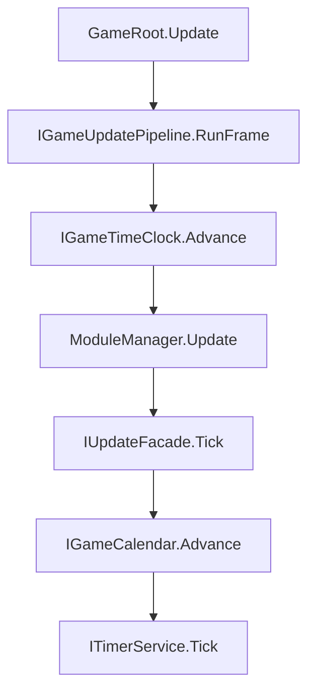

# GameTime API 参考

> 路径：`BaseFramework/BaseGameRoot/GameTime/`  
> 命名空间：`BaseFramework.BaseGameRoot`  
> 父模块：[BaseGameRoot/README.md](../README.md)（GameRoot / TryStart / Module 调度）

GameTime 提供游戏时钟、双时刻模型（连续 + 日历）、定时器与三相位轻量订阅门面。须在 Bootstrap 中注册 **`GameTimeModule`** 后，业务方可通过 `IServiceRegistry.Get` 使用下列服务。

---

## 1. 快速接入

### 1.1 Bootstrap 注册

```csharp
modules.AddModule(new GameTimeModule(new GameTimeOptions
{
    CalendarSettings = new GameCalendarSettings { SecondsPerDay = 120f },
    InitialTimeScale = 1f
}));
```

未传 `CalendarSettings` 时仅启用连续时刻 A；日历字段 `Day/Hour/Minute` 恒为 0。

### 1.2 Module 缓存依赖

```csharp
public void Init(IServiceRegistry services)
{
    _clock = services.Get<IGameTimeClock>();
    _moment = services.Get<IGameMomentProvider>();
    _timeline = services.Get<ISessionTimeline>();
    _calendar = services.Get<IGameCalendar>();
    _timers = services.Get<ITimerService>();
    _updateFacade = services.Get<IUpdateFacade>();
    _fixedFacade = services.Get<IFixedUpdateFacade>();
    _lateFacade = services.Get<ILateUpdateFacade>();
}
```

| 阶段 | 推荐 | 避免 |
|------|------|------|
| `Init` | `services.Get` 赋字段 | — |
| `Update` 等 | 用缓存字段 | 热路径 `IoC.Get` / `services.Get` |

---

## 2. 架构与帧顺序

### 2.1 Update 相位（游戏时间）

Clock、Calendar、Timer **均在 Update**，使用 **gameDelta**（受 TimeScale / 暂停影响）。



顺序：

1. `clock.Advance(Time.deltaTime)` → `GameDeltaTime`
2. `ModuleManager.Update(gameDelta)`
3. `IUpdateFacade.Tick(gameDelta)`
4. `IGameCalendar.Advance(gameDelta)`（已 Configure 时）
5. `ITimerService.Tick(gameDelta)`

### 2.2 FixedUpdate / LateUpdate 相位

| 相位 | Pipeline 方法 | delta | 包含 |
|------|---------------|-------|------|
| FixedUpdate | `RunFixedFrame` | Unity `fixedDeltaTime` | Module + `IFixedUpdateFacade` |
| LateUpdate | `RunLateFrame` | Unity `deltaTime` | Module + `ILateUpdateFacade` |

Fixed / Late **不含** Clock / Calendar / Timer。Timer 有意放在 Update，以便与 TimeScale、暂停语义一致（与 TEngine / GameFramework 相同）。

---

## 3. 双时刻模型

| 模型 | 接口 | 主要字段 | 启用条件 |
|------|------|----------|----------|
| **A 连续** | `IGameTimeClock` + `ISessionTimeline` | `GameTime`, `Frame`, `ChapterId` | 始终 |
| **B 日历** | `IGameCalendar` | `Day`, `Hour`, `Minute` | `GameTimeOptions.CalendarSettings` 非 null |

聚合读取：`IGameMomentProvider.Now` → `GameMoment` 结构体（A + B 字段一次拿齐）。

### 3.1 日历配置

| 方式 | 用法 |
|------|------|
| Bootstrap 注入 | `new GameTimeModule(new GameTimeOptions { CalendarSettings = … })` |
| 运行时覆盖 | `_calendar.Configure(new GameCalendarSettings { … })`（调试 / 剧情跳日） |

---

## 4. 数据类型

### 4.1 GameMoment

只读时刻快照。

| 成员 | 类型 | 说明 |
|------|------|------|
| `GameTime` | `float` | 累计游戏时间（秒） |
| `Frame` | `long` | 游戏帧计数 |
| `ChapterId` | `int` | 章节 / 关卡 ID（A） |
| `Day` | `int` | 游戏日（B；未启用日历时为 0） |
| `Hour` | `int` | 游戏小时（B） |
| `Minute` | `int` | 游戏分钟（B） |

### 4.2 GameCalendarSettings

| 成员 | 类型 | 默认 | 说明 |
|------|------|------|------|
| `SecondsPerDay` | `float` | `120` | 1 游戏日 = 多少游戏秒 |
| `HoursPerDay` | `int` | `24` | 每日小时数 |
| `MinutesPerHour` | `int` | `60` | 每小时分钟数 |

### 4.3 GameTimeOptions

`GameTimeModule` 构造参数。

| 成员 | 类型 | 默认 | 说明 |
|------|------|------|------|
| `CalendarSettings` | `GameCalendarSettings` | `null` | 为 null 时不启用日历 B |
| `InitialTimeScale` | `float` | `1` | 启动时 Clock.TimeScale |

### 4.4 TimerHandle

| 成员 | 类型 | 说明 |
|------|------|------|
| `Invalid` | `TimerHandle` | 无效句柄（Id = 0） |
| `Id` | `int` | 内部 ID |
| `IsValid` | `bool` | Id != 0 |

---

## 5. 时钟与时刻 API

### 5.1 IGameTimeClock

| 成员 | 类型 | 说明 |
|------|------|------|
| `RealTime` | `float` | 只读；不受 TimeScale / 暂停影响 |
| `GameTime` | `float` | 只读；累计游戏时间 |
| `DeltaTime` | `float` | 只读；上一帧 gameDelta |
| `Frame` | `long` | 只读；游戏帧计数 |
| `TimeScale` | `float` | 读写；≤ 0 时 GameTime 不推进 |
| `IsPaused` | `bool` | 读写；true 时 GameTime / Frame 冻结 |
| `Advance(rawDelta)` | — | 由 Pipeline 调用，业务一般不直接调 |
| `Reset()` | — | 重置全部计时 |

**TimeScale / 暂停行为：**

- `IsPaused == true` 或 `TimeScale <= 0`：`GameTime`、`Frame` 不增，`DeltaTime == 0`；Timer 不 Tick。
- `RealTime` 始终随 Unity 帧推进。

### 5.2 ISessionTimeline（连续时刻 A）

| 成员 | 类型 | 说明 |
|------|------|------|
| `ChapterId` | `int` | 只读；当前章节 ID |
| `SetChapter(int)` | — | 切换章节，不重置 GameTime |

### 5.3 IGameCalendar（日历时刻 B）

| 成员 | 类型 | 说明 |
|------|------|------|
| `IsEnabled` | `bool` | 是否已 Configure |
| `Day` / `Hour` / `Minute` | `int` | 只读；当前日历 |
| `OnDayChanged` | `event Action<int>` | 跨日时触发，参数为新 Day |
| `Configure(settings)` | — | 启用 / 覆盖配置 |
| `Advance(gameDelta)` | — | 由 Pipeline 调用 |

### 5.4 IGameMomentProvider

| 成员 | 类型 | 说明 |
|------|------|------|
| `Now` | `GameMoment` | 当前时刻快照 |

---

## 6. ITimerService（定时器）

基于 **游戏时间** 的离散调度；在 Update 相位、Module 之后 Tick。

| 方法 | 返回 | 说明 |
|------|------|------|
| `Delay(seconds, callback)` | `TimerHandle` | **游戏时间** `seconds` 后执行一次 |
| `Repeat(intervalSeconds, callback)` | `TimerHandle` | 每隔 **游戏时间** `intervalSeconds` 重复执行 |
| `Cancel(handle)` | — | 取消指定定时器 |
| `CancelAll()` | — | 取消全部 |

**语义对照（业务常用写法）：**

```csharp
// 1 游戏秒后执行一次（等价 DelayExecute）
TimerHandle h1 = _timers.Delay(1f, DoFunc);

// 每隔 1 游戏秒执行（等价 RepeatExecute）
TimerHandle h2 = _timers.Repeat(1f, DoFunc);

_timers.Cancel(h2);
```

| vFramework | TEngine TimerModule |
|------------|---------------------|
| `Delay(t, cb)` | `AddTimer(cb, t, isLoop: false)` |
| `Repeat(t, cb)` | `AddTimer(cb, t, isLoop: true)` |
| `Cancel(handle)` | `RemoveTimer(timerId)` |

**注意：**

- 回调在 **Module Update 之后** 触发（同帧内 `Delay(0f, …)` 可在当帧末尾执行）。
- `Repeat` 须主动 `Cancel`，或在 Module `Dispose` / 场景切换时取消；`GameTimeModule.Dispose` 会 `CancelAll`。
- 暂停或 `TimeScale = 0` 时 Timer **不推进**（与 TEngine scaled 列表一致）。

### 6.1 Timer 与 Update 门面区分

| | **ITimerService** | **IUpdateFacade 等** |
|--|-------------------|----------------------|
| 调用频率 | 到期 / 间隔才调 | **每帧** |
| 典型用途 | 技能 CD、延迟弹窗、刷怪间隔 | 跟随、插值、每帧检测 |
| 等待期 | 无每帧回调开销 | 每帧进入 `Update` |
| 结束 | Delay 自动移除 | 须 `Remove` |

| 场景 | 选用 |
|------|------|
| 每帧连续逻辑 | `IUpdateFacade` / `IGameModule` |
| N 秒后 / 每 N 秒一次 | **`ITimerService`** |
| 物理步长每帧 | `IFixedUpdateFacade` |
| 渲染后跟随 | `ILateUpdateFacade` |

---

## 7. 轻量订阅门面

不必实现完整 `IGameModule` 时的三相位订阅。

### 7.1 IUpdatable + IUpdateFacade

```csharp
public sealed class HudTicker : IUpdatable
{
    public void Update(float deltaTime) { /* gameDelta */ }
}

_updateFacade.Add(new HudTicker());
_updateFacade.Remove(ticker);
_updateFacade.Clear();
```

| 方法 | 说明 |
|------|------|
| `Add(IUpdatable)` | 订阅；同实例不重复添加 |
| `Remove(IUpdatable)` | 取消订阅 |
| `Clear()` | 清空全部 |

delta = **gameDelta**（Update 相位）。

### 7.2 IFixedUpdatable + IFixedUpdateFacade

接口方法：`void FixedUpdate(float fixedDeltaTime)`  
delta = Unity **`fixedDeltaTime`**（未乘 TimeScale）。

### 7.3 ILateUpdatable + ILateUpdateFacade

接口方法：`void LateUpdate(float deltaTime)`  
delta = Unity **`deltaTime`**。

Tick 期间 `Add` / `Remove` 延迟到当帧回调结束后生效。

---

## 8. IGameUpdatePipeline

由 `GameRoot` 持有；业务通常 **不直接调用**，仅作架构参考。

| 成员 | 说明 |
|------|------|
| `GameDeltaTime` | 上一帧 Advance 后的 gameDelta |
| `RunFrame(rawDelta, moduleUpdate)` | Update 全链 |
| `RunFixedFrame(rawFixedDelta, moduleFixedUpdate)` | Fixed 链 |
| `RunLateFrame(rawDelta, moduleLateUpdate)` | Late 链 |

---

## 9. 完整示例

### 9.1 读时刻与切章节

```csharp
GameMoment now = _moment.Now;
Debug.Log($"t={now.GameTime} ch={now.ChapterId} D{now.Day} {now.Hour}:{now.Minute}");

_timeline.SetChapter(2);
```

### 9.2 日历跨日

```csharp
public void Init(IServiceRegistry services)
{
    _calendar = services.Get<IGameCalendar>();
    _calendar.OnDayChanged += OnNewDay;
}

void OnNewDay(int day) => Debug.Log($"New game day: {day}");
```

### 9.3 Delay / Repeat

```csharp
TimerHandle _spawnLoop;

public void Init(IServiceRegistry services)
{
    _timers = services.Get<ITimerService>();
    _timers.Delay(3f, () => Debug.Log("3 game seconds later"));
    _spawnLoop = _timers.Repeat(5f, SpawnWave);
}

public void Dispose()
{
    _timers.Cancel(_spawnLoop);
}
```

### 9.4 慢动作

```csharp
_clock.TimeScale = 0.5f;  // 游戏时间减半；Timer、Calendar 同步变慢
_clock.IsPaused = true;   // 冻结游戏时间；RealTime 仍走
```

---

## 10. 目录结构

```text
GameTime/
├── GameTimeApi.md      ← 本文档
├── Interface/          公开接口与数据类型
└── Impt/               GameTimeModule、Pipeline、默认实现
```

---

## 11. 已知限制（Phase 1）

| 项 | 说明 |
|----|------|
| 无 unscaled Timer | 不支持 TEngine `isUnscaled` 真实时间定时 |
| 无 Timer Pause/Resume | 仅 `Cancel` / `CancelAll` |
| Fixed 未乘 TimeScale | FixedUpdate / FixedFacade 用 Unity 原生 delta |
| Delay 精度 | 链表遍历，大量 Timer 时后续可优化为堆 |
