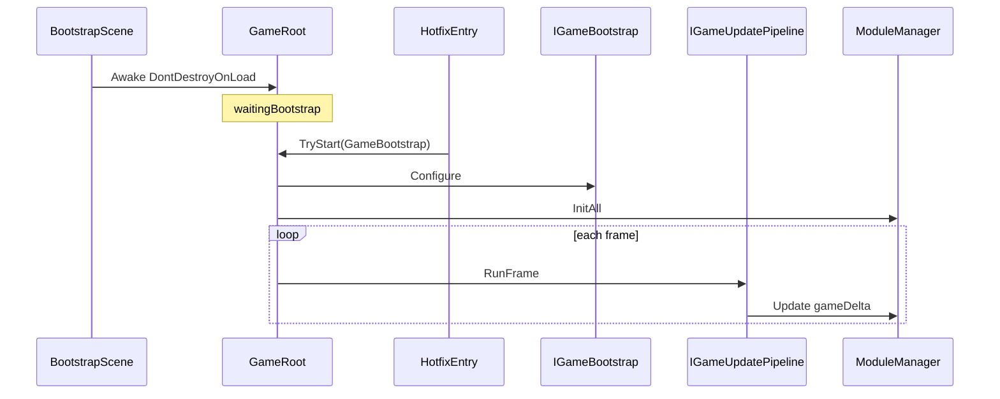

# BaseGameRoot 模块说明

> 路径：`BaseFramework/BaseGameRoot/`（**AOT 固定层**，见 [BaseFramework/README.md](../README.md)）  
> Bootstrap Scene 唯一 Mono 入口、IOC 服务容器、模块 Update 调度。

---

## 1. 职责

| 组件 | 职责 |
|------|------|
| **GameRoot** | 单例 Mono；`Awake` 占位 → 热更后 `TryStart` 装配 → 三相位 Update → `OnDestroy` 释放 |
| **GameBootstrapRegistry** | 持有 `IGameBootstrap` 实例（由 `TryStart` 写入） |
| **ServiceContainer** | 接口 → 单例实例映射 |
| **IoC** | 静态门面，委托 `ServiceContainer` |
| **ModuleManager** | 按 `Priority` 排序，`InitAll` / Update / FixedUpdate / LateUpdate / Editor Gizmo / `DisposeAll` |
| **GameTimeModule** | 内置 Clock / 双时刻 / Timer / UpdateFacade / Pipeline（`ModulePriority.Early`） |
| **GameFlowModule** | 宏观游戏流程 FSM（Boot / 主菜单 / …）；`IGameFlowService`（`ModulePriority.GameFlow`） |
| **IGameBootstrap** | 业务装配：`Register` Service + `AddModule`（**热更层实现**，不在 BaseFramework 长期驻留） |

本目录只提供 **AOT 框架骨架**；玩法 Module / Service 在热更层实现，通过 **`GameRoot.TryStart`** 接入（路径 B，对标 TEngine `GameApp.Entrance`）。

> `HotUpdateBootStrap/` 内 `GameBootstrap`、`HotUpdateGameEntry` 为 **过渡联调代码**，目标迁入 `HotUpdateScripts/` 等热更目录（见 [BaseFramework/README.md §3.1](../README.md)）。

---

## 2. 架构（路径 B：热更后启动）

```text
Bootstrap Scene：仅挂 GameRoot（DontDestroyOnLoad）
GameRoot.Awake
    → 单例 + DontDestroyOnLoad
    → 若 Registry 已有 Bootstrap → StartPipeline
    → 否则 _waitingBootstrap = true（等 TryStart）
热更 / 逻辑程序集加载完成（或 Editor 下 GameLaunchRunner.Awake）
    → HotfixLaunchCoordinator.TryLaunchGame()
    → 反射 HotUpdateGameEntry.OnHotfixLoaded → TryStart(GameBootstrap)
    → Register + Configure + InitAll
GameRoot.Update / FixedUpdate / LateUpdate
    → IGameUpdatePipeline.RunFrame（若已注册 GameTimeModule）
    → ModuleManager（游戏时间 delta；无 Pipeline 时回退 Unity deltaTime）
    → UpdateFacade → Calendar → Timer
```



### 与 TEngine / GameFramework 对照

| 概念 | TEngine | vFramework |
|------|---------|------------|
| 热更入口 | `GameApp.Entrance` | **`GameRoot.TryStart`** |
| 业务装配 | `GameApp_RegisterSystem` | **`IGameBootstrap.Configure`** |
| 框架 Mono | Procedure 驱动 | **GameRoot** + **GameFlowModule** |
| Inspector 拖 Bootstrap | 无 | **无** |

---

## 3. 目录结构

```text
BaseGameRoot/
├── GameLaunch/
│   ├── HotfixLaunchCoordinator.cs   ← AOT：反射调热更入口
│   └── GameLaunchRunner.cs          ← Editor/Bootstrap 场景 Awake 自动 Launch
├── GameRoot/
│   ├── GameRoot.cs
│   ├── Interface/
│   │   ├── IGameModule.cs
│   │   ├── IFixedUpdateModule.cs
│   │   ├── ILateUpdateModule.cs
│   │   ├── IGizmoDrawModule.cs
│   │   ├── IGizmoDrawSelectedModule.cs
│   │   ├── IGameBootstrap.cs
│   │   ├── IServiceRegistry.cs
│   │   └── IModuleRegistry.cs
│   └── Impt/
│       ├── GameBootstrapRegistry.cs
│       ├── ServiceContainer.cs
│       ├── ModuleManager.cs
│       ├── IoC.cs
│       └── ModulePriority.cs
├── GameFlow/
│   ├── GameFlowApi.md   宏观流程 API + 设计思想
│   ├── Interface/
│   ├── Impt/
│   ├── Events/
│   └── States/          MVP 示例状态（Boot / MainMenu）
└── GameTime/
    ├── GameTimeApi.md   业务 API 参考（Clock / 双时刻 / Timer / Facade）
    ├── Interface/
    └── Impt/
```

命名空间：`BaseFramework.BaseGameRoot`。

---

## 4. 业务接入（路径 B）

### 4.1 步骤清单

| 步骤 | 做什么 |
|------|--------|
| 1 | 实现 `IGameBootstrap`（普通 C# 类） |
| 2 | 在 `Configure` 里 `Register` / `AddModule` |
| 3 | Bootstrap Scene **只挂 GameRoot**（无 Bootstrap 字段） |
| 4 | HybridCLR 加载完成后 **`HotfixLaunchCoordinator.TryLaunchGame()`**（Editor 可用 `GameLaunchRunner`） |

### 4.2 IGameBootstrap

```csharp
public sealed class GameBootstrap : IGameBootstrap
{
    public void Configure(IServiceRegistry services, IModuleRegistry modules)
    {
        var input = new InputModule();
        var gameplay = new GameplayService();

        services.Register<IInputService>(input);
        services.Register<IGameplayService>(gameplay);

        modules.AddModule(new GameTimeModule(new GameTimeOptions
        {
            CalendarSettings = new GameCalendarSettings { SecondsPerDay = 120f },
            InitialTimeScale = 1f
        }));
        modules.AddModule(GameFlowModule.CreateMvp());
        modules.AddModule(input);
        modules.AddModule(new GameLogicModule());
        modules.AddModule(gameplay);
    }
}
```

### 4.3 热更入口（HybridCLR / 路径 B）

**AOT（框架）** 只通过反射调用热更入口，不硬引用 `GameBootstrap`：

```csharp
// Launcher 或 GameLaunchRunner（Awake）在 HybridCLR Load 完成后：
HotfixLaunchCoordinator.TryLaunchGame();
// → 反射 HotUpdateGameEntry.OnHotfixLoaded()
```

**热更程序集** 实现装配并 TryStart：

```csharp
public static class HotUpdateGameEntry
{
    public static bool OnHotfixLoaded()
    {
        return GameRoot.TryStart(new GameBootstrap());
    }
}
```

| 场景 | 用法 |
|------|------|
| Editor / Init 联调 | Bootstrap 场景挂 `GameLaunchRunner` 或 `HotUpdateGameEntryRunner`（Awake 自动 Launch） |
| 正式 HybridCLR | Launcher 场景：`LoadMetadata` + `LoadAssembly` → `HotfixLaunchCoordinator.TryLaunchGame()` → 再进 Init |

`GameRoot.Start` 会 **延后一帧** 检查是否已 TryStart，避免与 Launch Runner 的 Awake 竞态。

- `TryStart` 成功：Register → `Configure` → `InitAll`
- `GameRoot` 尚未 Awake：仅 Register，Awake 时自动 `StartPipeline`
- 已启动后再调 `TryStart`：LogError，返回 false
- 首帧 `Start` 仍未启动：LogError 并 `enabled = false`

### 4.4 Module 取依赖

```csharp
public void Init(IServiceRegistry services)
{
    _input = services.Get<IInputService>();
    _gameplay = services.Get<IGameplayService>();
}
```

### 4.5 依赖注入约定

| 阶段 | 推荐 | 避免 |
|------|------|------|
| `Configure` | `Register` / `AddModule` | `IoC.Get` |
| `Init` | `services.Get` 赋字段 | Update 内 Get |
| `Update` 等 | 用缓存字段 | 热路径 `IoC.Get` |

---

## 5. 场景挂载

1. Bootstrap Scene：唯一 GameObject 挂 **GameRoot**。
2. **不要**在 Inspector 拖 Bootstrap 引用。
3. 热更流程在适当时机调用 **`GameRoot.TryStart`**。

---

## 6. API

### 6.1 GameRoot

| 成员 | 说明 |
|------|------|
| `Instance` | 全局单例 |
| `IsStarted` | 是否已完成 Configure / InitAll |
| `TryStart(IGameBootstrap)` | **热更入口**；注册并启动管道 |
| `Services` / `ModuleManager` | 启动后只读 |

### 6.2 GameBootstrapRegistry

| 方法 | 说明 |
|------|------|
| `Register` | 写入 Bootstrap（`TryStart` 内部调用） |
| `TryGet` | GameRoot Awake 时尝试读取 |

### 6.3 IGameModule / 可选相位 / ModulePriority

| 接口 | 调度 |
|------|------|
| `IGameModule` | `Update`（必选） |
| `IFixedUpdateModule` | `FixedUpdate` |
| `ILateUpdateModule` | `LateUpdate` |
| `IGizmoDrawModule` | Editor `OnDrawGizmos` → Scene 视图 |
| `IGizmoDrawSelectedModule` | Editor `OnDrawGizmosSelected`（选中 GameRoot 时） |

| 常量 | 值 | 典型模块 |
|------|-----|----------|
| `Input` | 0 | InputModule |
| `Early` | 100 | GameTimeModule |
| `GameFlow` | 150 | GameFlowModule |
| `Normal` | 500 | ArchiveModule |
| `GameLogic` | 600 | 战斗 ECS |
| `Late` | 900 | DebugCommandModule |
| `UI` | 1000 | UIMgr |

### 6.4 IoC

`IoC.Get<T>()` 仅迁移/调试；Module `Init` 优先 `services.Get`。

### 6.5 Editor Scene Gizmo（IGizmoDrawModule）

Module 为纯 C#，Gizmo 只能由 **`GameRoot` Mono** 转发。实现可选接口后，在 **Play 且 TryStart 成功** 时，Scene 视图（Gizmos 开关打开）可见。

```csharp
public sealed class PathDebugModule : IGameModule, IGizmoDrawModule
{
    private Vector3[] _points;

    public int Priority => ModulePriority.GameLogic;

    public void Init(IServiceRegistry services) { /* 缓存依赖 */ }
    public void Update(float deltaTime) { /* 更新 _points */ }
    public void Dispose() { _points = null; }

    public void DrawGizmos()
    {
        if (_points == null || _points.Length < 2) return;

        Gizmos.color = Color.green;
        for (int i = 0; i < _points.Length - 1; i++)
            Gizmos.DrawLine(_points[i], _points[i + 1]);
    }
}
```

| 注意 | 说明 |
|------|------|
| 回调内 | 只用 `Gizmos.*`，读 Init/Update 缓存，勿 `services.Get` |
| 未启动 | Edit Mode / 未 `TryStart` 时不绘制（`_started` 门禁） |
| 编译 | 调度代码仅 `#if UNITY_EDITOR`，Player 包无开销 |
| 选中细节 | 实现 `IGizmoDrawSelectedModule` 绘制额外线条 |

---

## 8. GameTime

内置子模块：游戏时钟、连续 + 日历双时刻、`ITimerService`（Delay / Repeat）、三相位 Update 门面。Bootstrap 中注册 `GameTimeModule` 后，`GameRoot` 经 `IGameUpdatePipeline` 驱动 Update / Fixed / Late。

**详细 API、示例与 Timer / Facade 选型** → [GameTime/GameTimeApi.md](GameTime/GameTimeApi.md)

```csharp
modules.AddModule(new GameTimeModule(new GameTimeOptions
{
    CalendarSettings = new GameCalendarSettings { SecondsPerDay = 120f }
}));
```

---

## 9. GameFlow

内置子模块：宏观游戏阶段（Boot → 主菜单 → …），单当前态 + `Enter/Update/Exit`，无 `MonoBehaviour`。Bootstrap 注册 `GameFlowModule` 后，业务实现 `IGameFlowState` 并在 Configure 中 `Register`；运行时经 `IGameFlowService` 查询与切换。

**详细 API、设计思想、新增状态步骤** → [GameFlow/GameFlowApi.md](GameFlow/GameFlowApi.md)

```csharp
modules.AddModule(GameFlowModule.CreateMvp(extra: reg =>
    reg.Register(new ProcedureBattle())));  // 热更层状态

modules.AddModule(new DebugCommandModule(reg =>
    GameFlowModule.RegisterDebugCommands(reg)));
```

---

## 10. 扩展设计

| 阶段 | 内容 |
|------|------|
| Phase 1 ✅ | `IGameModule` + `ServiceContainer` + Update |
| Phase 2 ✅ | Fixed / Late 相位 |
| Phase 2.5 ✅ | GameTime 双时刻 + Pipeline |
| Phase 2.6 ✅ | GameFlow 宏观流程 MVP（Boot / MainMenu） |
| Phase 3 | `EcsWorldModule` |
| 启动 | **路径 B** `TryStart`（Boot 态可衔接 Patch / LoadAssembly） |
