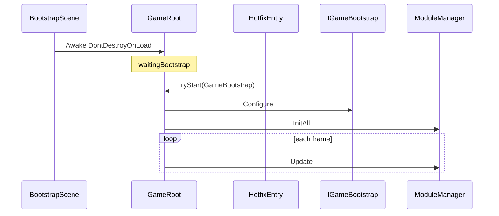

# BaseGameRoot 模块说明

> 路径：`BaseFramework/BaseGameRoot/`  
> Bootstrap Scene 唯一 Mono 入口、IOC 服务容器、模块 Update 调度。

---

## 1. 职责

| 组件 | 职责 |
|------|------|
| **GameRoot** | 单例 Mono；`Awake` 占位 → 热更后 `TryStart` 装配 → 三相位 Update → `OnDestroy` 释放 |
| **GameBootstrapRegistry** | 持有 `IGameBootstrap` 实例（由 `TryStart` 写入） |
| **ServiceContainer** | 接口 → 单例实例映射 |
| **IoC** | 静态门面，委托 `ServiceContainer` |
| **ModuleManager** | 按 `Priority` 排序，`InitAll` / `Update` / `FixedUpdate` / `LateUpdate` / `DisposeAll` |
| **IGameBootstrap** | 业务装配：`Register` Service + `AddModule`（热更层实现） |

本目录只提供框架骨架；玩法 Module / Service 在热更层实现，通过 **`GameRoot.TryStart`** 接入（路径 B，对标 TEngine `GameApp.Entrance`）。

---

## 2. 架构（路径 B：热更后启动）

```text
Bootstrap Scene：仅挂 GameRoot（DontDestroyOnLoad）
GameRoot.Awake
    → 单例 + DontDestroyOnLoad
    → 若 Registry 已有 Bootstrap → StartPipeline
    → 否则 _waitingBootstrap = true（等 TryStart）
热更 / 逻辑程序集加载完成
    → GameRoot.TryStart(new GameBootstrap())
    → Register + Configure + InitAll
GameRoot.Update / FixedUpdate / LateUpdate
    → ModuleManager（仅 _started 后）
```



### 与 TEngine / GameFramework 对照

| 概念 | TEngine | vFramework |
|------|---------|------------|
| 热更入口 | `GameApp.Entrance` | **`GameRoot.TryStart`** |
| 业务装配 | `GameApp_RegisterSystem` | **`IGameBootstrap.Configure`** |
| 框架 Mono | Procedure 驱动 | **GameRoot** |
| Inspector 拖 Bootstrap | 无 | **无** |

---

## 3. 目录结构

```text
BaseGameRoot/
└── GameRoot/
    ├── GameRoot.cs
    ├── Interface/
    │   ├── IGameModule.cs
    │   ├── IFixedUpdateModule.cs
    │   ├── ILateUpdateModule.cs
    │   ├── IGameBootstrap.cs
    │   ├── IServiceRegistry.cs
    │   └── IModuleRegistry.cs
    └── Impt/
        ├── GameBootstrapRegistry.cs
        ├── ServiceContainer.cs
        ├── ModuleManager.cs
        ├── IoC.cs
        └── ModulePriority.cs
```

命名空间：`BaseFramework.BaseGameRoot`。

---

## 4. 业务接入（路径 B）

### 4.1 步骤清单

| 步骤 | 做什么 |
|------|--------|
| 1 | 实现 `IGameBootstrap`（普通 C# 类） |
| 2 | 在 `Configure` 里 `Register` / `AddModule` |
| 3 | Bootstrap Scene **只挂 GameRoot**（无 Bootstrap 字段） |
| 4 | 热更 DLL 加载完成后调用 **`GameRoot.TryStart(new GameBootstrap())`** |

### 4.2 IGameBootstrap

```csharp
public sealed class GameBootstrap : IGameBootstrap
{
    public void Configure(IServiceRegistry services, IModuleRegistry modules)
    {
        var input = new InputModule();
        var gameplay = new GameplayService();

        services.Register<IInputService>(input);
        services.Register<IGameplayService>(gameplay);

        modules.AddModule(input);
        modules.AddModule(new GameLogicModule());
        modules.AddModule(gameplay);
    }
}
```

### 4.3 热更入口（对标 GameApp.Entrance）

```csharp
public static class GameEntry
{
    public static void OnHotfixLoaded()
    {
        if (!GameRoot.TryStart(new GameBootstrap()))
            Debug.LogError("GameRoot.TryStart failed.");
    }
}
```

- `TryStart` 成功：Register → `Configure` → `InitAll`
- `GameRoot` 尚未 Awake：仅 Register，Awake 时自动 `StartPipeline`
- 已启动后再调 `TryStart`：LogError，返回 false
- 首帧 `Start` 仍未启动：LogError 并 `enabled = false`

### 4.4 Module 取依赖

```csharp
public void Init(IServiceRegistry services)
{
    _input = services.Get<IInputService>();
    _gameplay = services.Get<IGameplayService>();
}
```

### 4.5 依赖注入约定

| 阶段 | 推荐 | 避免 |
|------|------|------|
| `Configure` | `Register` / `AddModule` | `IoC.Get` |
| `Init` | `services.Get` 赋字段 | Update 内 Get |
| `Update` 等 | 用缓存字段 | 热路径 `IoC.Get` |

---

## 5. 场景挂载

1. Bootstrap Scene：唯一 GameObject 挂 **GameRoot**。
2. **不要**在 Inspector 拖 Bootstrap 引用。
3. 热更流程在适当时机调用 **`GameRoot.TryStart`**。

---

## 6. API

### 6.1 GameRoot

| 成员 | 说明 |
|------|------|
| `Instance` | 全局单例 |
| `IsStarted` | 是否已完成 Configure / InitAll |
| `TryStart(IGameBootstrap)` | **热更入口**；注册并启动管道 |
| `Services` / `ModuleManager` | 启动后只读 |

### 6.2 GameBootstrapRegistry

| 方法 | 说明 |
|------|------|
| `Register` | 写入 Bootstrap（`TryStart` 内部调用） |
| `TryGet` | GameRoot Awake 时尝试读取 |

### 6.3 IGameModule / ModulePriority / IServiceRegistry

见原 §6.2–6.4；`ModulePriority.GameLogic` = 核心玩法（600）。

### 6.4 IoC

`IoC.Get<T>()` 仅迁移/调试；Module `Init` 优先 `services.Get`。

---

## 7. 扩展设计

| 阶段 | 内容 |
|------|------|
| Phase 1 ✅ | `IGameModule` + `ServiceContainer` + Update |
| Phase 2 ✅ | Fixed / Late 相位 |
| Phase 3 | `EcsWorldModule` |
| 启动 | **路径 B** `TryStart`（可与未来 ProcedureLoadAssembly 流程衔接） |
