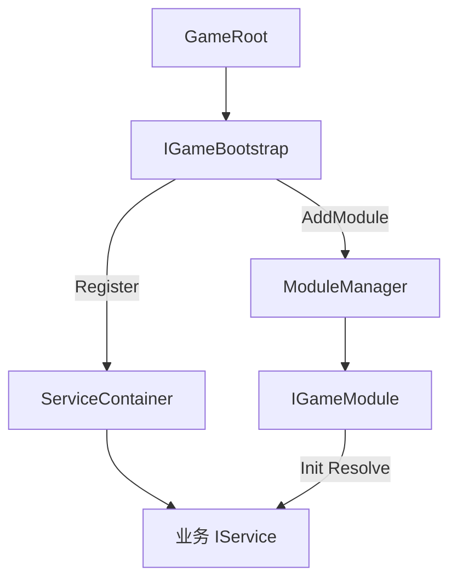

# BaseGameRoot 模块说明

> 路径：`BaseFramework/BaseGameRoot/`  
> Bootstrap Scene 唯一 Mono 入口、IOC 服务容器、模块 Update 调度。

---

## 1. 职责

| 组件 | 职责 |
|------|------|
| **GameRoot** | 单例 Mono；`Awake` 装配 → `Update` / `FixedUpdate` / `LateUpdate` 驱动模块 → `OnDestroy` 逆序释放 |
| **ServiceContainer** | 接口 → 单例实例映射 |
| **IoC** | 静态门面，委托 `ServiceContainer`（迁移/调试用） |
| **ModuleManager** | 按 `Priority` 排序，`InitAll` / `Update` / `FixedUpdate` / `LateUpdate` / `DisposeAll` |
| **IGameBootstrap** | 业务装配入口：集中 `Register` Service、`AddModule`（**必填**，由热更层实现并挂到 GameRoot） |

本目录只提供框架骨架；玩法 Module / Service 在 HotUpdate 层实现，通过 `IGameBootstrap.Configure` 注册。

---

## 2. 架构

```text
GameRoot.Awake
    → 校验 Bootstrap Behaviour（必须实现 IGameBootstrap）
    → ServiceContainer + ModuleManager
    → IGameBootstrap.Configure(services, modules)   // 业务注册 Service + Module
    → ModuleManager.InitAll(services)               // 各 Module Init，Resolve 依赖
GameRoot.Update       → ModuleManager.Update(deltaTime)
GameRoot.FixedUpdate  → ModuleManager.FixedUpdate(fixedDeltaTime)   // IFixedUpdateModule
GameRoot.LateUpdate   → ModuleManager.LateUpdate(deltaTime)         // ILateUpdateModule
GameRoot.OnDestroy    → DisposeAll（逆序）+ Clear 容器
```



---

## 3. 目录结构

```text
BaseGameRoot/
└── GameRoot/
    ├── GameRoot.cs
    ├── Interface/
    │   ├── IGameModule.cs
    │   ├── IFixedUpdateModule.cs
    │   ├── ILateUpdateModule.cs
    │   ├── IGameBootstrap.cs
    │   ├── IServiceRegistry.cs
    │   └── IModuleRegistry.cs
    └── Impt/
        ├── ServiceContainer.cs
        ├── ModuleManager.cs
        ├── IoC.cs
        └── ModulePriority.cs
```

命名空间：`BaseFramework.BaseGameRoot`。

---

## 4. 业务注册 Service 与 Module（HotUpdate 层）

### 4.1 步骤清单

| 步骤 | 做什么 |
|------|--------|
| 1 | 定义业务接口，如 `IGameplayService`、`IInputService` |
| 2 | 实现类；需每帧逻辑则同时实现 `IGameModule`（及可选 `IFixedUpdateModule` / `ILateUpdateModule`） |
| 3 | 实现 `IGameBootstrap`（建议 `MonoBehaviour`，便于挂 Inspector） |
| 4 | 在 `Configure` 里 `services.Register<IXxx>(instance)` |
| 5 | 需参与帧循环的实例再 `modules.AddModule(instance)` 或 `modules.AddModule(new XxxModule())` |
| 6 | Bootstrap Scene：GameObject 挂 `GameRoot`，**Bootstrap Behaviour** 指向 Bootstrap 组件 |

### 4.2 Bootstrap 示例

```csharp
public sealed class GameBootstrap : MonoBehaviour, IGameBootstrap
{
    public void Configure(IServiceRegistry services, IModuleRegistry modules)
    {
        var input = new InputModule();
        var ui = new UIModule();
        var gameplay = new GameplayService();

        services.Register<IInputService>(input);
        services.Register<IUIService>(ui);
        services.Register<IGameplayService>(gameplay);

        modules.AddModule(input);
        modules.AddModule(new GameLogicModule());
        modules.AddModule(ui);
        modules.AddModule(gameplay);
    }
}
```

### 4.3 只注册 Service、不 AddModule

无帧循环的纯服务只 `Register`，不 `AddModule`：

```csharp
services.Register<IConfigService>(new ConfigService());
// 其他 Module 在 Init 里 services.Resolve<IConfigService>()
```

### 4.4 Module 取用依赖

```csharp
public sealed class GameLogicModule : IGameModule
{
    private IInputService _input;
    private IGameplayService _gameplay;

    public int Priority => ModulePriority.GameLogic;

    public void Init(IServiceRegistry services)
    {
        _input = services.Resolve<IInputService>();
        _gameplay = services.Resolve<IGameplayService>();
    }

    public void Update(float deltaTime)
    {
        _gameplay.OnUpdate(deltaTime);
    }

    public void Dispose() { }
}
```

### 4.5 同一实例：Service + Module

实现类可同时承担 Service 与 Module（例如 `InputModule : IInputService, IGameModule`）：一次 `new`，`Register` 与 `AddModule` 使用同一引用。

### 4.6 构造注入（可选）

依赖关系明确时，在 Bootstrap 内先 `new` 再注册，避免 Service 内部 `Resolve`：

```csharp
var ui = new UIModule();
var gameplay = new GameplayService(ui);
services.Register<IUIService>(ui);
services.Register<IGameplayService>(gameplay);
```

### 4.7 依赖注入约定

| 阶段 | 推荐 | 避免 |
|------|------|------|
| `Configure` | `services.Register`、`modules.AddModule` | `IoC.Get` |
| `Init` | `services.Resolve` 赋给字段 | 在 Update 内 Resolve |
| `Update` / `FixedUpdate` / `LateUpdate` | 使用 Init 缓存的字段 | 热路径 `IoC.Get` |

---

## 5. 场景挂载

1. Bootstrap Scene 放置 **唯一** 带 `GameRoot` 的 GameObject。
2. 同场景挂载业务 `GameBootstrap : MonoBehaviour, IGameBootstrap`。
3. Inspector：**Bootstrap Behaviour** 必须指向该 Bootstrap 组件。
4. 未挂载或未实现 `IGameBootstrap` 时，`GameRoot` 打 Error 并 `enabled = false`，不会启动空容器。

---

## 6. API

### 6.1 GameRoot

| 成员 | 说明 |
|------|------|
| `Instance` | 全局单例 |
| `Services` | 只读 `IServiceRegistry` |
| `ModuleManager` | 只读模块管理器 |
| **Bootstrap Behaviour** | **必填**；须实现 `IGameBootstrap` |

`DefaultExecutionOrder(-10000)`；`DontDestroyOnLoad`。

### 6.2 IGameModule

```csharp
public interface IGameModule
{
    int Priority => ModulePriority.Normal;
    void Init(IServiceRegistry services);
    void Update(float deltaTime);
    void Dispose();
}
```

| `ModulePriority` | 值 | 典型用途 |
|------------------|-----|----------|
| `Input` | 0 | 输入采集 |
| `Early` | 100 | 早更新 |
| `Normal` | 500 | 默认 |
| `GameLogic` | 600 | 核心玩法 / 规则 / 仿真 |
| `Late` | 900 | 晚更新 |
| `UI` | 1000 | 表现 / UI |

数值越小越先执行；业务可自定义 `int`，常量之间留空便于插入。

### 6.3 IFixedUpdateModule / ILateUpdateModule

```csharp
public interface IFixedUpdateModule : IGameModule
{
    void FixedUpdate(float fixedDeltaTime);
}

public interface ILateUpdateModule : IGameModule
{
    void LateUpdate(float deltaTime);
}
```

`InitAll` 时缓存需参与 Fixed/Late 的模块；未实现的模块不会进入对应相位列表。

多相位示例：

```csharp
public sealed class FollowTargetModule : ILateUpdateModule
{
    public int Priority => ModulePriority.Late;

    public void Init(IServiceRegistry services) { }

    public void Update(float deltaTime) { /* 计算目标 */ }

    public void LateUpdate(float deltaTime) { /* 应用 Transform */ }

    public void Dispose() { }
}
```

### 6.4 IServiceRegistry

```csharp
void Register<T>(T instance) where T : class;
T Resolve<T>() where T : class;
bool TryResolve<T>(out T instance) where T : class;
bool IsRegistered<T>() where T : class;
void Clear();
```

- 键为 `typeof(T)`，注册时 `T` 通常为**接口**。
- `Resolve` 未注册时抛 `InvalidOperationException`。
- 无反射；Register / Resolve 仅在启动期。

### 6.5 IGameBootstrap

```csharp
void Configure(IServiceRegistry services, IModuleRegistry modules);
```

业务**唯一**装配点；`GameRoot` 在 `Configure` 之后自动 `InitAll`。

### 6.6 ModuleManager

| 方法 | 说明 |
|------|------|
| `Configure(bootstrap, services)` | 调用业务 `Configure` |
| `AddModule(module)` | 注册模块（仅 `InitAll` 前） |
| `InitAll(services)` | 排序 + `Init` + 缓存 Fixed/Late 列表 |
| `Update` / `FixedUpdate` / `LateUpdate` | 三相位调度 |
| `DisposeAll()` | 逆序释放 |

### 6.7 IoC（静态，过渡用）

```csharp
IoC.Get<T>();
IoC.TryGet<T>(out T instance);
```

优先在 `Init` 中 `Resolve`；`IoC.Get` 仅用于迁移或 Editor 调试。

---

## 7. 扩展设计

| 阶段 | 内容 |
|------|------|
| Phase 1 ✅ | `IGameModule` + `ServiceContainer` + `Update` |
| Phase 2 ✅ | `IFixedUpdateModule` / `ILateUpdateModule` |
| Phase 3 | `EcsWorldModule : IGameModule`，内部 ECS `Systems.Update()` |
| Phase 4 | Service 写 Component；Module 只调度 |

`Priority` 与 ECS System 组顺序对应；三相位均用索引 `for` 遍历，无每帧分配。
