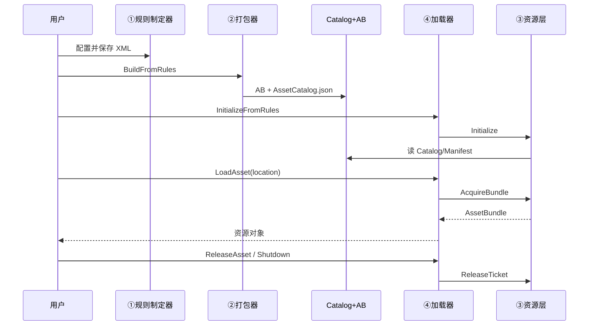

# ABundleLayer 架构说明

> vFramework 资源层 · AssetBundle 子模块  
> 四个核心部分：**① 规则制定器 → ② 打包器 → ③ 抽象资源层 → ④ 加载器**

---

## 总览

```
┌──────────────────┐    ┌──────────────────┐    ┌─────────────────────────┐    ┌──────────────────┐
│ ① 规则制定器      │───►│ ② 打包器          │───►│ 平台目录 + Catalog 索引  │───►│ ④ 加载器          │
│ RuleEditor       │    │ ABundlePacker    │    │ AssetCatalog.json       │    │ ABundleLoader    │
└──────────────────┘    └──────────────────┘    └─────────────────────────┘    └────────┬─────────┘
                                                                                          │
                                                                                          ▼
                                                                                 ┌──────────────────┐
                                                                                 │ ③ 抽象资源层      │
                                                                                 │ ResourceSystem   │
                                                                                 └──────────────────┘
```

| 原则 | 说明 |
|------|------|
| 一份规则走全程 | `ABundleBuildRules` 用于 Editor 打包与 Runtime 初始化 |
| Editor / Runtime 分离 | 打标签、Build 仅在 Editor；真机读产物 + Catalog |
| 业务只认 location | 如 `icon/3`，不直接写包名 |
| 加载/释放成对 | `LoadAsset` ↔ `ReleaseAsset`；票据释放整条依赖链 |

---

## ① 规则制定器

### 职责

Unity Editor 工具：用户配置分包策略、平台、输出路径、LoadMode，保存为 **规则 XML**。

### 入口

- 菜单：`vFramework → AssetKit → ABundleBuilder`

### 代码

| 文件 | 说明 |
|------|------|
| `Editor/RuleEditor/ABundleRuleEditorWindow.cs` | 规则制定器 UI |
| `Core/ABundleRules.cs` | `ABundleBuildRules`、`ABundleBuildRule`、`ABundleRulesXmlIO`、`ABundlePathUtility` |
| `Core/ABundleTypes.cs` | 平台、PackMode、LoadMode 枚举 |
| `Editor/Config/ABundleBuildRules.xml` | 默认规则 |

### 规则字段摘要

| 分组 | 字段 |
|------|------|
| 资源来源 | `RootFolder` |
| 分包 | `PackMode`、`BundleNamePrefix`、`CustomRules` |
| 输出 | `OutputPath`、`BuildTarget` |
| 索引 | `LocationMode`、`GenerateCatalog`、`CatalogFileName` |
| 运行时 | `LoadMode` |

### PackMode

| 模式 | 行为 |
|------|------|
| `ByTopLevelFolder` | 一级子文件夹各一包 |
| `ByDirectoryTree` | 每个文件夹（含嵌套）一包 |
| `SingleRootBundle` | 根目录全部一包 |
| `CustomRules` | 仅 CustomRules 列表 |

---

## ② 打包器

### 职责

按规则执行：**校验 → 打标签 → BuildAssetBundles → 生成 Catalog → 报告**。

### 输出目录

```
{OutputPath}/{BuildTarget}/
├── AssetBundles              # Unity Manifest 包
├── demo/icon                 # 业务 AB
├── AssetCatalog.json         # location 索引（加载器用）
└── ABundleBuildReport.json
```

### 代码

| 文件 | 说明 |
|------|------|
| `Editor/Builder/ABundlePacker.cs` | 打包器（`#region`：过滤、打标签、Catalog、报告、入口） |
| `Core/ABundleData.cs` | Catalog / 报告数据结构 |

### 主要类型

| 类 | 作用 |
|----|------|
| `BundleAssetFilter` | 过滤不可打包资源 |
| `BundleLabelApplier` | 写 `assetBundleName` |
| `CatalogGenerator` | 生成 `AssetCatalog.json` |
| `ABundleBuildReporter` | 校验与打包报告 |
| `ABundlePacker` | 打包入口 `BuildFromRules` |
| `ABundleBuildPipeline` | 兼容别名 → `ABundlePacker` |

---

## ③ 抽象资源层

### 职责

对 AB 包的**独立 public 模块**：Catalog 寻址、依赖顺序、包缓存、引用计数。  
加载器不直接 `LoadFromFile`，统一通过本层。

### 代码（`Core/Resource/`）

| 文件 | 类 | 职责 |
|------|-----|------|
| `IABundleResourceSystem.cs` | `IABundleResourceSystem` | 资源层接口 |
| `ABundleResourceSystem.cs` | `ABundleResourceSystem` | 门面：`AcquireBundle` / `ReleaseTicket` |
| `ABundleLoadTicket.cs` | `ABundleLoadTicket` | 一次加载持有的依赖链票据 |
| `BundleCache.cs` | `BundleCache`、`BundleRefCounter` | 包实例缓存与引用计数 |
| `CatalogProvider.cs` | `CatalogProvider`、`DependencyResolver` | Catalog 与 Manifest 依赖 |

### 加载 / 释放流程

```
AcquireBundle("demo/ui")
  → 按 Manifest 加载依赖链
  → 每个包 Retain +1
  → 返回 ABundleLoadTicket（含 RetainedBundleNames）

ReleaseTicket(ticket)
  → 对票据中每个包 Release -1
  → 计数为 0 则 Unload(false)
```

---

## ④ 加载器

### 职责

对外 **薄 API**：Initialize、同步/异步 Load、按 location 或包名卸载。

### 代码（`Core/Loader/`）

| 文件 | 说明 |
|------|------|
| `IABundleLoader.cs` | 加载器接口 |
| `ABundleLoader.cs` | 实现，委托 `ABundleResourceSystem` |

### API

| 方法 | 说明 |
|------|------|
| `InitializeFromRules(rules)` | **推荐**：按规则读平台目录 + Catalog |
| `LoadAsset<T>(location)` | 同步加载 |
| `LoadAssetAsync<T>(location, callback)` | 异步（当前同步+回调，可换 Unity 原生异步） |
| `ReleaseAsset(location)` | 释放该 location 的 LoadTicket（含依赖链） |
| `LoadBundle` / `ReleaseBundle` | 按包名加载/释放 |
| `UnloadAll` / `Shutdown` | 卸载全部 |

### LoadMode

| 模式 | 行为 |
|------|------|
| `EditorSimulation` | Editor 下 `AssetDatabase` 直读 |
| `RuntimeBundle` | `LoadFromFile` 读真 AB |

### 示例

```csharp
var loader = new ABundleLoader();
loader.InitializeFromRules(ABundleRulesXmlIO.Load(ABundleRulesXmlIO.DefaultRulesRelativePath));

var tex = loader.LoadAsset<Texture2D>("icon/3");

loader.LoadAssetAsync<GameObject>("ui/test/testui", prefab => { /* ... */ });

loader.ReleaseAsset("icon/3");   // 推荐：与 LoadAsset 成对
loader.UnloadAll(false);
loader.Shutdown();
```

---

## 目录结构

```
ABundleLayer/
├── Core/
│   ├── ABundleTypes.cs
│   ├── ABundleData.cs
│   ├── ABundleRules.cs
│   ├── Resource/                    # ③ 抽象资源层
│   │   ├── IABundleResourceSystem.cs
│   │   ├── ABundleResourceSystem.cs
│   │   ├── ABundleLoadTicket.cs
│   │   ├── BundleCache.cs
│   │   └── CatalogProvider.cs
│   └── Loader/                      # ④ 加载器
│       ├── IABundleLoader.cs
│       └── ABundleLoader.cs
├── Editor/
│   ├── RuleEditor/                  # ① 规则制定器
│   │   └── ABundleRuleEditorWindow.cs
│   ├── Builder/                     # ② 打包器
│   │   └── ABundlePacker.cs
│   ├── Analyzer/                    # 辅助：依赖分析
│   │   ├── ABundleAnalyzerCore.cs
│   │   └── ABundleAnalyzerWindow.cs
│   ├── ABundleEditorUtility.cs
│   └── Config/
│       └── ABundleBuildRules.xml
├── Demo/
│   ├── ABundleDemoRunner.cs
│   └── TestAB.unity
└── Docs/
    └── ABundleLayer架构说明.md
```

---

## 协作时序



---

## 快速上手

1. `vFramework/AssetKit/ABundleBuilder` → 配置 → 保存 XML → 打包  
2. 确认 `StreamingAssets/AssetBundles/Windows/AssetCatalog.json` 存在  
3. 打开 `Demo/TestAB.unity`，Play，点「加载资源 / 卸载资源」  
4. 业务：`InitializeFromRules` → `LoadAsset` → `ReleaseAsset` → `Shutdown`

---

## 辅助工具

| 菜单 | 作用 |
|------|------|
| `vFramework/AssetKit/ABundleAnalyzer` | Manifest 依赖、反向依赖、Location 查询 |

---

*文档与代码目录同步维护。*
