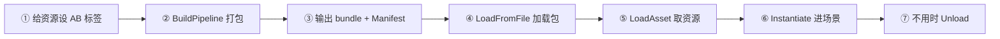
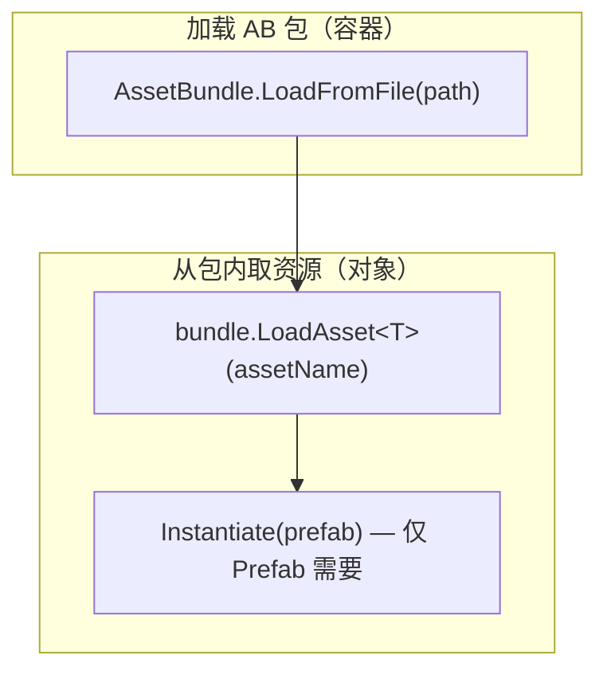

# AssetBundle 使用指南

本文档从 **设置标签 → 打包（BuildPipeline）→ 运行时加载 → 卸载** 讲解 Unity AssetBundle（AB）的通用流程，不依赖特定项目结构。

---

## 1. AssetBundle 是什么

**AssetBundle** 是把 Unity 资源（Prefab、模型、材质、贴图、场景等）序列化成的**独立二进制文件**，运行时从磁盘或网络读取。

与 `Resources` 的对比：

| 维度 | Resources | AssetBundle |
|------|-----------|-------------|
| 打进安装包 | 固定打进 `Resources` 目录 | 可放 `StreamingAssets`，也可热更下载 |
| 加载 API | `Resources.Load(path)` | `LoadFromFile` → `LoadAsset` |
| 依赖管理 | Unity 自动 | 需通过 Manifest 管理包间依赖 |
| 适用场景 | 原型、极小项目 | 商业项目、热更、分包 |

---

## 2. 整体流程



**最小链路示例：**

```text
Enemy.prefab（标签 prefabs/enemy）
    → Editor 脚本调用 BuildAssetBundles
    → 输出目录/prefabs/enemy
    → LoadFromFile → LoadAsset("Enemy") → Instantiate
```

---

## 3. 第一步：设置 AB 标签

### 3.1 在 Inspector 中设置

1. 在 Project 窗口选中资源（如 `Assets/Prefabs/Enemy.prefab`）。
2. 看 Inspector **最底部** 的 **Asset Labels** 区域。
3. **AssetBundle** 下拉 → **New…** → 输入包名，例如：`prefabs/enemy`。
4. **Variant** 建议留空。初学不要用 Variant，否则磁盘文件名会多后缀（如 `enemy.hd`）。

包名 `prefabs/enemy` 表示：输出目录下会生成子文件夹 `prefabs/`，其内文件名为 `enemy`。

包名支持 `/` 表示层级，便于组织，如 `ui/panels`、`characters/hero`、`scenes/level01`。

### 3.2 只给入口资源打标签（单包模式）

若**只**给 Prefab 设 AB 名，不给 Model / Material / Texture 单独设标签，Unity 会把 **Prefab 引用的依赖** 自动打进**同一个包**：

```text
Enemy.prefab
  ├─ Enemy.fbx
  ├─ Enemy.mat
  └─ enemy_diffuse.png
```

未被引用的资源**不会**进包。

适合：学习、小资源、快速验证。

### 3.3 按类型拆成多个包（多包模式）

商业项目常拆成：

| 包名示例 | 内容 |
|----------|------|
| `models/enemy` | FBX / 网格 |
| `materials/enemy` | 材质 |
| `textures/enemy` | 贴图 |
| `prefabs/enemy` | Prefab |

每个**会被引用到的**资源都要单独设 AB 名。运行时需先加载 Manifest，再按依赖顺序加载各包。见 **第 8 节**。

### 3.4 用代码批量设置标签

```csharp
// 放在 Editor 文件夹下
using UnityEditor;

static void SetBundleName(string assetPath, string bundleName)
{
    var importer = AssetImporter.GetAtPath(assetPath);
    if (importer != null)
        importer.assetBundleName = bundleName;
}

// 示例
SetBundleName("Assets/Prefabs/Enemy.prefab", "prefabs/enemy");
```

### 3.5 注意

- 必须对 **资源文件本身**（`.prefab` / `.fbx` / `.mat` / `.png`）设置，给**文件夹**设 AB 名不会让子资源自动进包。
- 同一资源只能归属一个 AB 包。
- Shader 通常来自工程或 Package，不一定打进 AB；真机若材质粉红，需单独处理 Shader 变体收集。

---

## 4. 第二步：打包（BuildPipeline）

### 4.1 打包脚本放哪里

`BuildPipeline` 属于 **Editor API**，脚本必须放在名为 `Editor` 的文件夹下（可在 `Assets` 下任意层级），例如：

```text
Assets/Editor/BuildAssetBundles.cs
```

不能写在普通 `MonoBehaviour` 里。

### 4.2 最小打包脚本

```csharp
using System.IO;
using UnityEditor;
using UnityEngine;

public static class BuildAssetBundles
{
    const string OutputPath = "Assets/StreamingAssets/AssetBundles";

    [MenuItem("Tools/Build AssetBundles")]
    public static void Build()
    {
        Directory.CreateDirectory(OutputPath);

        BuildPipeline.BuildAssetBundles(
            OutputPath,
            BuildAssetBundleOptions.None,
            EditorUserBuildSettings.activeBuildTarget);

        AssetDatabase.Refresh();
        Debug.Log($"AB 打包完成: {Path.GetFullPath(OutputPath)}");
    }
}
```

### 4.3 BuildPipeline.BuildAssetBundles 详解

```csharp
AssetBundleManifest BuildPipeline.BuildAssetBundles(
    string outputPath,
    BuildAssetBundleOptions assetBundleOptions,
    BuildTarget targetPlatform
);
```

| 参数 | 含义 |
|------|------|
| `outputPath` | AB 输出目录。可为 `Assets/...` 相对路径，或磁盘绝对路径 |
| `assetBundleOptions` | 压缩、强制重打等选项（见 4.5） |
| `targetPlatform` | 目标平台；**AB 必须用与运行环境一致的平台构建** |

**返回值 `AssetBundleManifest`：** 描述本次构建所有 AB 及其依赖。Editor 内可直接使用；运行时需加载输出目录下与**输出文件夹同名**的主 Manifest 包（见第 5 节）。

**Build 时 Unity 内部步骤：**

1. 扫描所有设置了 `assetBundleName` 的资源；
2. 分析引用关系，决定每个包包含哪些资源、包与包之间的依赖；
3. 序列化为二进制 bundle 文件；
4. 为每个包生成文本 `.manifest`，并生成主 Manifest 包；
5. 若 `outputPath` 在 `Assets` 下，执行 `AssetDatabase.Refresh`。

### 4.4 输出目录选择

| 输出位置 | 典型用途 | 运行时如何访问 |
|----------|----------|----------------|
| `Assets/StreamingAssets/AssetBundles` | 首包内置、Editor 快速测试 | `Application.streamingAssetsPath` |
| `Assets/ABOutput` | 仅 Editor 测试、不进玩家包 | `Application.dataPath + "/ABOutput/..."` |
| 项目外 `D:/Build/AB/Windows/` | CI、上传 CDN、热更 | `Application.persistentDataPath` 或下载目录 |

**规则：** 改输出目录后，必须同步修改运行时的 `LoadFromFile` 路径。

`StreamingAssets` 文件夹**必须**位于 `Assets/StreamingAssets`（紧贴 `Assets` 下一级）；AB 文件可放在其子目录，如 `AssetBundles/`。

### 4.5 常用 BuildAssetBundleOptions

| 选项 | 作用 |
|------|------|
| `None` | 默认 LZMA 压缩整包；体积小，加载时需解压 |
| `ChunkBasedCompression` | 分块 LZ4；适合大资源与热更 |
| `ForceRebuildAssetBundle` | 忽略增量缓存，全量重打 |
| `DisableWriteTypeTree` | 包更小；要求读写 Unity 版本一致 |
| `AppendHashToAssetBundleName` | 包名追加 Hash，利于缓存与版本管理 |

初学用 `None` 即可。

### 4.6 打包后的目录结构

假设输出到 `Assets/StreamingAssets/AssetBundles`，且有一个标签为 `prefabs/enemy` 的包：

```text
AssetBundles/                    ← 输出根目录
├── AssetBundles                 ← 主 Manifest 包（名字 = 输出文件夹名）
├── AssetBundles.manifest
├── prefabs/
│   ├── enemy                    ← 对应标签 prefabs/enemy
│   └── enemy.manifest
└── ...
```

文本 manifest 示例：

```yaml
Assets:
- Assets/Prefabs/Enemy.prefab
Dependencies: []                 # 单包时为空；多包时列出依赖包名
```

**三种「名字」不要混淆：**

| 类型 | 示例 | 用途 |
|------|------|------|
| 工程路径 | `Assets/Prefabs/Enemy.prefab` | 仅编辑器 |
| AB 包名 / 磁盘路径 | `prefabs/enemy` | `LoadFromFile` |
| 包内资源名 | `Enemy` | `LoadAsset`（多为文件名，以 manifest 为准） |

---

## 5. Manifest 与依赖

### 5.1 两类 Manifest

| 文件 | 作用 |
|------|------|
| `xxx.manifest`（文本） | 人工查看：包内资源、依赖、CRC |
| 与输出文件夹同名的二进制包 | 运行时加载，内含 `AssetBundleManifest` 对象 |

### 5.2 运行时读取 Manifest

```csharp
using System.IO;
using UnityEngine;

void LoadWithManifest(string bundleRoot, string targetBundleName)
{
    // 主包名 = 输出目录文件夹名，此处为 "AssetBundles"
    var manifestBundle = AssetBundle.LoadFromFile(
        Path.Combine(bundleRoot, "AssetBundles"));

    var manifest = manifestBundle.LoadAsset<AssetBundleManifest>(
        "AssetBundleManifest");

    // 获取目标包的全部依赖（含间接依赖）
    string[] deps = manifest.GetAllDependencies(targetBundleName);
    foreach (var dep in deps)
    {
        AssetBundle.LoadFromFile(Path.Combine(bundleRoot, dep));
    }

    AssetBundle.LoadFromFile(Path.Combine(bundleRoot, targetBundleName));

    manifestBundle.Unload(false);
}
```

**单包模式**可跳过 Manifest，直接 `LoadFromFile` 目标包。

### 5.3 AssetBundleManifest 常用 API

| API | 说明 |
|-----|------|
| `GetAllAssetBundles()` | 所有包名 |
| `GetAllDependencies(bundleName)` | 全部依赖 |
| `GetDirectDependencies(bundleName)` | 直接依赖 |

---

## 6. 第三步：运行时加载

### 6.1 加载分两层



| API | 说明 |
|-----|------|
| `AssetBundle.LoadFromFile(path)` | 同步加载包；path 指向 bundle 文件（通常无扩展名） |
| `AssetBundle.LoadFromFile(path, crc)` | 带 CRC 校验的加载 |
| `AssetBundle.LoadFromFileAsync(path)` | 异步加载包 → `AssetBundleCreateRequest` |
| `bundle.LoadAsset<T>(name)` | 同步取包内资源 |
| `bundle.LoadAssetAsync<T>(name)` | 异步取资源 → `AssetBundleRequest` |
| `Instantiate(prefab)` | Prefab 模板实例化进场景 |

贴图、音频、材质等加载后可直接使用，**不需要** `Instantiate`。

### 6.2 同步加载示例（单包）

```csharp
using System.IO;
using UnityEngine;

public class AbLoadExample : MonoBehaviour
{
    void Start()
    {
        string bundlePath = Path.Combine(
            Application.streamingAssetsPath,
            "AssetBundles/prefabs/enemy");

        var bundle = AssetBundle.LoadFromFile(bundlePath);
        if (bundle == null)
        {
            Debug.LogError("AB 包加载失败");
            return;
        }

        var prefab = bundle.LoadAsset<GameObject>("Enemy");
        if (prefab == null)
        {
            Debug.LogError("包内找不到资源，请查看 enemy.manifest");
            return;
        }

        Instantiate(prefab);
    }
}
```

### 6.3 异步加载示例

```csharp
using System.Collections;
using System.IO;
using UnityEngine;

IEnumerator LoadEnemyAsync()
{
    string bundlePath = Path.Combine(
        Application.streamingAssetsPath,
        "AssetBundles/prefabs/enemy");

    var bundleReq = AssetBundle.LoadFromFileAsync(bundlePath);
    yield return bundleReq;

    var bundle = bundleReq.assetBundle;
    if (bundle == null) yield break;

    var assetReq = bundle.LoadAssetAsync<GameObject>("Enemy");
    yield return assetReq;

    Instantiate(assetReq.asset as GameObject);
}
```

### 6.4 从网络下载后加载

```csharp
using System.Collections;
using UnityEngine;
using UnityEngine.Networking;

IEnumerator DownloadAndLoad(string url)
{
    using (var req = UnityWebRequestAssetBundle.GetAssetBundle(url))
    {
        yield return req.SendWebRequest();
        if (req.result != UnityWebRequest.Result.Success)
            yield break;

        var bundle = DownloadHandlerAssetBundle.GetContent(req);
        var prefab = bundle.LoadAsset<GameObject>("Enemy");
        Instantiate(prefab);
    }
}
```

### 6.5 路径与平台注意

- **StreamingAssets：** `Application.streamingAssetsPath + "/相对路径"`。
- **Variant：** 若 Variant 为 `hd`，磁盘文件名为 `enemy.hd`，路径要对应修改。
- **Android：** StreamingAssets 在 APK 内，部分情况下 `LoadFromFile` 不可用，需 `UnityWebRequest` 读取。
- **缓存：** 同一包避免重复 `LoadFromFile`，应用层用 `Dictionary<string, AssetBundle>` 缓存。

---

## 7. 第四步：卸载

| 对象 | 释放方式 |
|------|----------|
| 场景实例 | `Destroy(gameObject)` |
| AB 包 | `bundle.Unload(false)` 或 `Unload(true)` |

```csharp
bundle.Unload(false);  // 卸包壳，已 Load 出的资源仍可用（常用）
bundle.Unload(true);   // 连已加载资源一起卸；仍在使用的会变 Missing（慎用）
```

**原则：**

- Prefab：**Destroy 实例** 与 **Unload 包** 是两件事。
- 谁 `LoadFromFile` 谁 `Unload`；每个包只 `Unload` 一次。
- 全局清理无引用资源：`Resources.UnloadUnusedAssets()`。

---

## 8. 多包依赖加载（进阶）

拆包后，`prefabs/enemy` 的 manifest 可能类似：

```yaml
Dependencies:
- models/enemy
- materials/enemy
- textures/enemy
```

**加载顺序：**

```text
加载主 Manifest 包
    → GetAllDependencies("prefabs/enemy")
    → 依次 LoadFromFile 所有依赖包
    → LoadFromFile("prefabs/enemy")
    → LoadAsset("Enemy")
    → Instantiate
```

依赖未加载会导致：Missing Mesh、材质粉红、贴图丢失。

---

## 9. 常见问题

| 现象 | 可能原因 |
|------|----------|
| `LoadFromFile` 返回 null | 未 Build；路径错误；平台与 BuildTarget 不一致 |
| `LoadAsset` 返回 null | 资源名错误；应查对应 `.manifest` 的 `Assets` 列表 |
| 材质粉红 | 依赖包未加载；Shader 变体未打进包或未包含在 Always Included Shaders |
| 包体积意外很大 | 把未使用资源也标了 AB；或依赖被打进多包需检查拆包策略 |
| Editor 有包、真机没有 | 输出不在 `StreamingAssets` 且未随 BuildPlayer 拷贝 |
| Android LoadFromFile 失败 | APK 内路径限制，改用 `UnityWebRequest` |

---

## 10. 上手检查清单

- [ ] 至少一个资源已设置 AssetBundle 名，Variant 为空（初学）
- [ ] Editor 脚本在 `Editor` 文件夹，菜单可执行 Build
- [ ] Build 目标平台与运行平台一致
- [ ] 输出目录下存在目标 bundle 文件及 `.manifest`
- [ ] `LoadFromFile` 路径与输出目录一致
- [ ] `LoadAsset` 使用 manifest 中的资源短名
- [ ] Prefab 已 `Instantiate`；不用时已 `Destroy` / `Unload`

---

## 11. BuildPipeline 相关 API 扩展

| API / 概念 | 说明 |
|------------|------|
| `BuildPipeline.BuildAssetBundles` | 核心打包入口 |
| `AssetImporter.assetBundleName` | 代码设置 AB 标签 |
| `BuildPipeline.BuildPlayer` | 打玩家包；与 AB 构建独立，常先 AB 再 BuildPlayer |
| `UnityWebRequestAssetBundle.GetAssetBundle` | 从 URL 下载 AB |
| CRC | manifest 中的校验值；`LoadFromFile(path, crc)` 可校验完整性 |
| `AssetBundle.RecompressAssetBundleAsync` | 已构建 AB 的压缩格式转换（工具向） |

---

## 12. 封装建议（可选）

原生 API 跑通后，商业项目通常在之上加一层资源管理：

```text
业务逻辑 Key（如 "enemy"）
    → 资源管理器（缓存、引用计数、异步合并）
    → AB 适配层（LoadFromFile、LoadAssetAsync、Unload）
    → Unity AssetBundle API
```

封装层负责：统一 Key、避免重复加载、引用归零时 `Unload`、多包依赖顺序、热更路径切换。底层仍依赖本章的 Build 与 Load 流程。

---

## 13. API 速查

**Editor**

```csharp
BuildPipeline.BuildAssetBundles(outputPath, options, buildTarget);
importer.assetBundleName = "prefabs/enemy";
importer.assetBundleVariant = "";  // 或 null
```

**运行时 — 包**

```csharp
AssetBundle.LoadFromFile(path);
AssetBundle.LoadFromFile(path, crc);
AssetBundle.LoadFromFileAsync(path);
AssetBundle.GetAllLoadedAssetBundles();
AssetBundle.UnloadAllAssetBundles(unloadAllLoadedObjects);
```

**运行时 — 包内资源**

```csharp
bundle.LoadAsset<T>(name);
bundle.LoadAssetAsync<T>(name);
bundle.LoadAllAssets<T>();
bundle.Unload(false);
```

**运行时 — Manifest**

```csharp
manifest.GetAllDependencies(bundleName);
manifest.GetDirectDependencies(bundleName);
manifest.GetAllAssetBundles();
```
