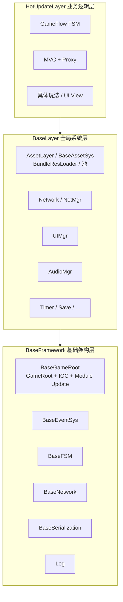
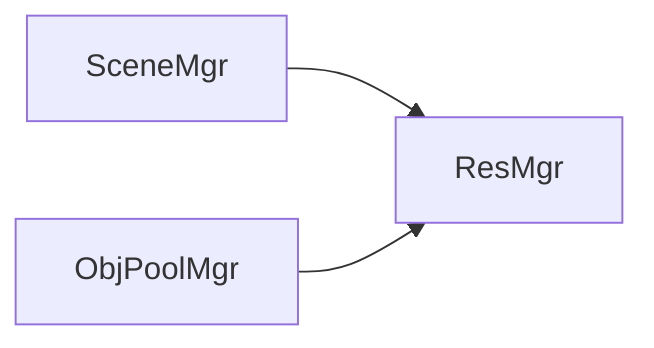
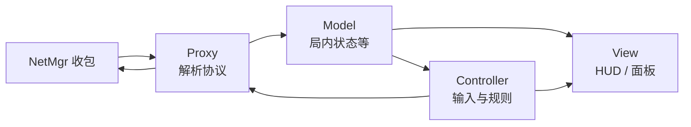

# 框架设计构思

本文档描述 **vFramework** 的分层架构、目录约定、模块职责与关键数据流。定位与范围见 [ProjectGoals.md](./ProjectGoals.md)。

---

## 1. 设计原则

1. **分层依赖单向**：逻辑层 → 全局系统层 → 基础架构层；禁止反向引用。
2. **依赖下沉**：第三方库（UniTask、Addressables、Protobuf 等）仅在底层引用，通过 **Interface + Impt（实现/适配）** 向上暴露能力。
3. **Manager 注册式单例**：全局系统由 **GameRoot** 统一 `Create` / `Init` / `Update` / `Destroy`，禁止各处懒加载 `Instance`。
4. **逻辑与表现分离**：业务层采用 **MVC + Proxy**；网络数据只进 Proxy，Model 变更再通知 Controller / View。
5. **资源用逻辑地址**：运行时以 `location` / `address` 加载，不写 `Assets/...` 磁盘路径。

---

## 2. 三层架构总览



| 层级 | 程序集（规划） | 职责 |
|------|----------------|------|
| **BaseFramework** | `BaseFramework`（**整目录 AOT，见 [BaseFramework/README.md](../BaseFramework/README.md)**） | 与具体玩法无关的基础设施：事件、FSM 内核、网络编解码、序列化、日志、GameRoot 入口 |
| **BaseLayer** | `BaseLayer` | 可复用的全局 Manager：资源、场景、池、UI、音频、网络会话等 |
| **HotUpdateLayer** | `HotUpdate` | 业务逻辑：流程、Proxy、Model、Controller、View（按项目扩展） |

---

## 3. 目录结构（当前约定）

```text
Assets/vFramework/
├── Docs/                          # 项目与框架文档
├── BaseFramework/                 # 基础架构层（★ 全部 AOT，见 BaseFramework/README.md）
│   ├── BaseGameRoot/              # 全局入口 Mono + IOC + 模块 Update（含 GameFlow）
│   ├── BaseEventSys/              # 事件总线（Interface / Impt）
│   ├── BaseAssetSys/              # AB 打包与加载（独立子系统，文档见 BaseAssetSys/Docs）
│   ├── BaseFSM/                   # 状态机内核
│   ├── BaseNetwork/               # 传输、包结构、编解码
│   ├── BaseSerialization/         # 序列化抽象
│   └── Log/                       # 日志
│
├── BaseLayer/                     # 全局系统层
│   ├── AssetLayer/                # 资源域文档与测试夹具（学习指南、ABSystemTester 等）
│   ├── TimeLayer/
│   ├── UI/
│   ├── Audio/
│   ├── Timer/
│   └── Save/
│
└── HotUpdateLayer/                # 业务逻辑层（热更）
    ├── Core/                      # AppContext, IProxy, IController
    ├── Model/
    ├── Proxy/
    ├── Controller/
    ├── View/
    └── GameFlow/
```

> **说明**  
> - **BaseGameRoot** 与 **BaseAssetSys** 为**同级、独立**子系统：前者只管 App 生命周期、IOC、模块 Update；后者只管打包、清单、Bundle 加载与 Ref。二者代码、文档、排期、测试门禁**互不混入**。  
> - 若需在游戏启动后使用资源 API，由热更层 `IGameBootstrap` **可选**注册资源相关 Module/Service，属于集成点而非耦合。  
> - `BaseAssetSys` 排期见 [BaseAssetSys/Docs/MainRoadmap.md](../BaseFramework/BaseAssetSys/Docs/MainRoadmap.md)；`BaseLayer/AssetLayer` 保留学习文档与测试夹具。

---

## 4. BaseFramework 模块说明

### 4.1 BaseGameRoot（全局入口，与资源加载无关）

**GameRoot**（Bootstrap Scene 唯一 MonoBehaviour）负责：

```text
Awake → ServiceContainer + ModuleManager（或等待 TryStart）
      → GameRoot.TryStart(IGameBootstrap)   // 热更入口，对标 TEngine GameApp.Entrance
      → IGameBootstrap.Configure
      → InitAll（模块 Init，Get 依赖）
Update → ModuleManager.Update
FixedUpdate → ModuleManager.FixedUpdate（IFixedUpdateModule）
LateUpdate → ModuleManager.LateUpdate（ILateUpdateModule）
OnDestroy → DisposeAll（逆序）+ Clear 容器
```

- 实现与范例：[BaseGameRoot/README.md](../BaseFramework/BaseGameRoot/README.md)  
- **GameFlow**（宏观流程）：[GameFlow/GameFlowApi.md](../BaseFramework/BaseGameRoot/GameFlow/GameFlowApi.md) — `GameFlowModule` + `IGameFlowService`，对标 Procedure。  
- **不包含** `Load` / `Release` / Bundle / 清单；资源能力在 **BaseAssetSys**，见 §5.1。  
- 各全局 Module 实现 `IGameModule`，在 `IGameBootstrap` 注册，**禁止** lazy `Instance` getter 隐式 `new`。

### 4.2 BaseEventSys

- 类型安全事件总线：`RegisterEvent` / `DeRegisterEvent` / `SentEvent`（见 BaseEventSys README）。
- 事件体实现 `IGameEvent`，推荐 `struct` + 轻量字段，避免长期持有 `UnityEngine.Object`。
- 框架级、跨层协作事件使用；高频局内逻辑优先走 Proxy / 直接调用，避免事件风暴。

### 4.3 BaseFSM 与 GameFlow（分工）

| 子系统 | 路径 | 状态 | 职责 |
|--------|------|------|------|
| **GameFlow** | `BaseGameRoot/GameFlow/` | **已实现 MVP** | **游戏专用**宏观流程：Boot、主菜单、进局内等；单当前态；`GameFlowModule` 进 Update |
| **BaseFSM** | `BaseFramework/BaseFSM/` | 规划中 | **通用** FSM 内核（AI、UI 子状态、嵌套小状态机）；多实例；**不替代** GameFlow |

- GameFlow 详细 API：[GameFlowApi.md](../BaseFramework/BaseGameRoot/GameFlow/GameFlowApi.md)  
- BaseFSM 将来仅提供 `Enter` / `Update` / `Exit` 机制，**不含**具体玩法状态名。

### 4.4 BaseNetwork

- `INetPackage`、编解码、RingBuffer、TCP/WebSocket 适配。
- **不含**具体玩法业务协议；业务协议在 HotUpdateLayer 的 Proxy 中注册。

### 4.5 异步约定

- 底层以 **UniTask** 为主；`RunOnThreadPool`、Delay 等通过 BaseFramework 工具封装，上层避免散落第三方 API。
- Unity API 必须在主线程；IO 与纯计算可在线程池，结果回主线程再应用。

详见 `BaseFramework/BaseEventSys/README.md`。

---

## 5. BaseLayer 模块说明

### 5.1 BaseAssetSys / AssetLayer（资源域，与 BaseGameRoot 独立）

**文档与排期**仅维护在 `BaseAssetSys/Docs/`（[MainRoadmap.md](../BaseFramework/BaseAssetSys/Docs/MainRoadmap.md)、[DocumentIndex.md](../BaseFramework/BaseAssetSys/Docs/DocumentIndex.md)），**不写入** BaseGameRoot README。

同一资源管线下的三个 Manager，**目录聚合、运行时独立**：

| Manager | 接口 | 职责 |
|---------|------|------|
| **ResMgr** | `IResMgr` | `LoadAssetAsync` / `Release` / 引用计数 |
| **SceneMgr** | `ISceneMgr` | 单场景 / Additive 加载与卸载、Loading 流程 |
| **ObjPoolMgr** | `IObjPoolMgr` | Spawn / Despawn（实体、特效、投射物等） |

关系：



- 底层加载通过 **IResLoader** 适配器实现，当前默认链为 **Addressables → Resources**（`CompositeResLoader`）；Adapter 仅在 AssetLayer `Impt/Loader` 中引用。
- 逻辑地址支持前缀：`addr://`（Addressables）、`res://`（Resources）；后续可扩展 `AssetBundleResLoader` 等实现。
- 逻辑层调用：`ResMgr.LoadAsync("location")` / `SceneMgr.LoadSingleAsync("scene_main")`，不直接调用 `Addressables.LoadAssetAsync` 或 `Resources.Load`。

**Init 顺序建议**：`ResMgr`（Priority 高）→ `SceneMgr` → `ObjPoolMgr`。

### 5.2 其他全局系统（规划）

| 模块 | 职责 |
|------|------|
| **NetMgr** | 连接、心跳、按 msgId 分发字节流 |
| **UIMgr** | 窗口栈、层级；加载 Prefab 委托 ResMgr |
| **AudioMgr** | BGM/SFX；加载 Clip 委托 ResMgr |
| **TimerMgr** | 延迟与重复调度 |
| **SaveMgr** | 本地存档 |

---

## 6. HotUpdateLayer：MVC + Proxy

面向具体业务玩法，采用 **PureMVC 风格** 的变体：



### 6.1 角色职责

| 角色 | 职责 | 示例 |
|------|------|------|
| **Model** | 纯数据，由 Proxy 写入 | `SessionModel`、`PlayerModel` |
| **Proxy** | 网络上下行、更新 Model、注册 msgId | `SessionProxy`、`PlayerProxy` |
| **Controller** | 玩家操作、局内规则；调 `GetProxy<T>()` 发请求 | `GameplayController` |
| **View** | UI 绑定 Model 或订阅事件刷新 | `HudView` |

### 6.2 AppContext（注册中心）

- `RegisterProxy<T>` / `GetProxy<T>`
- `RegisterController<T>` / `GetController<T>`
- `Shutdown` 时逆序 `OnRemove`，Proxy 注销网络 handler

**LogicBootstrap**（热更层）实现 `IGameBootstrap`，在 `Configure` 中注册 Proxy/Controller 与玩法 Module；GameRoot 只触发一次 Configure。

### 6.3 约定

- Model **仅 Proxy 写**；Controller 可读，写操作走 Proxy 方法。
- Proxy 更新 Model 后，通过 **GameEventBus** 或 Model 事件通知 Controller，避免 Proxy 直接调用 Controller。
- View 不持有 Proxy；玩家操作 → Controller → Proxy → NetMgr。

---

## 7. 网络与联机数据流（可选）

**下行（服务器 → 客户端）**

```text
NetMgr.OnMessage(msgId, bytes)
  → SessionProxy.OnStateSync(data)
  → SessionModel.ApplySnapshot(...)
  → Publish SessionUpdatedEvent
  → GameplayController / HudView 刷新
```

**上行（客户端 → 服务器）**

```text
View 点击操作
  → GameplayController.OnPlayerAction(...)
  → SessionProxy.RequestAction(...)
  → NetMgr.Send(msgId, payload)
```

业务同步字段（示例）：实体 ID、房间状态、分数、回合序号等——协议与 Proxy 同模块维护，NetMgr 保持通用。

---

## 8. 程序集与热更边界

> **AOT 固定层约定**：`Assets/vFramework/BaseFramework/` 下 **全部代码** 随主包 AOT 编译，不进入 HybridCLR 热更 DLL。详见 **[BaseFramework/README.md](../BaseFramework/README.md)**。

### 8.1 目录与程序集

| 程序集 / 目录 | AOT / 热更 | 内容 | 引用 |
|---------------|------------|------|------|
| **`BaseFramework/`** | **AOT（固定）** | GameRoot、BaseAssetSys、BaseEventSys、接口与启动管道 | UniTask、Unity 核心 |
| `BaseLayer/` | 默认 AOT（随 asmdef 约定） | 全局 Manager：ConfigTable、Input、Archive 等 | BaseFramework |
| `HotUpdate` / `HotUpdateScripts/` | **热更** | GameBootstrap、AppEntry、玩法 Module、配表生成代码 | BaseLayer、BaseFramework |

### 8.2 启动分工（HybridCLR）

| 侧 | 职责 |
|----|------|
| **AOT（BaseFramework）** | `GameRoot`、`HybridCLRLoader` / `HotfixLaunchCoordinator`、`GameLaunchRunner`（Editor） |
| **热更** | `GameBootstrap.Configure`、`HotUpdateGameEntry.OnHotfixLoaded` → `GameRoot.TryStart` |
| **热更** | Proxy、Controller、具体玩法、可热更 GameFlow 状态 |

### 8.3 禁止事项

- 在 `BaseFramework/` 内新增 **项目业务 Module 注册**（应放在热更层 `GameBootstrap`）
- 将 **配表生成 C#** 放入 `BaseFramework/`（应在 `HotUpdateScripts/MetaConfigs/`）
- 热更程序集 **引用** AOT 可以；AOT **不得** 硬编码依赖热更具体类型（除 HybridCLR 代码生成桥接或过渡期反射入口）

### 8.4 过渡说明

`BaseGameRoot/HotUpdateBootStrap/` 内现有 `GameBootstrap`、`HotUpdateGameEntry` 为 Editor 联调 **临时** 代码，**目标迁出** 至热更目录；迁出后 BaseFramework 仅保留框架启动设施。

---

## 9. 命名与代码约定

- 命名空间（规划）：`BaseFramework.*`、`BaseLayer.*`、`HotUpdate.*`
- 接口：`I` 前缀，置于各模块 `InterFace/` 目录
- 实现：置于 `Impt/` 目录
- 静态无状态工具（如 `GameEventBus`）可不走单例注册，但与 Manager 职责区分清楚

---

## 10. 实施优先级（P0 → P1）

### P0 — 框架骨架

1. **BaseGameRoot**：GameRoot + IOC + ModuleManager（与资源加载并行、独立验收）  
2. BaseEventSys（已有）  
3. **BaseAssetSys / AssetLayer**：加载 API 与测试门禁（见 BaseAssetSys MainRoadmap，不依赖 GameRoot 骨架完成）  
4. NetMgr 消息分发  
5. HotUpdate：AppContext + 示例 Proxy/Controller  

### P1 — 业务与联机扩展

6. GameFlow 扩展（Patch → Login → InGame 等 Procedure，见 GameFlowApi.md）  
7. UIMgr 最小窗口栈  
8. ObjPoolMgr 与 ResMgr 打通  
9. 第一条业务同步协议端到端（若项目需要联机）  

---

## 相关文档

| 文档 | 范围 |
|------|------|
| [BaseFramework/README.md](../BaseFramework/README.md) | **AOT 固定层**目录约定 |
| [ProjectGoals.md](./ProjectGoals.md) | 框架定位与目标 |
| [BaseGameRoot/README.md](../BaseFramework/BaseGameRoot/README.md) | 全局入口 + IOC（**非**资源加载） |
| [GameFlow/GameFlowApi.md](../BaseFramework/BaseGameRoot/GameFlow/GameFlowApi.md) | 宏观流程 API 与设计 |
| [BaseEventSys/README.md](../BaseFramework/BaseEventSys/README.md) | 事件总线 |
| [BaseAssetSys/Docs/MainRoadmap.md](../BaseFramework/BaseAssetSys/Docs/MainRoadmap.md) | AB 打包/加载排期（**独立**于 GameRoot） |
