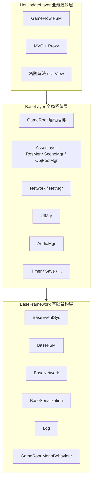
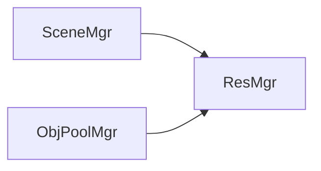
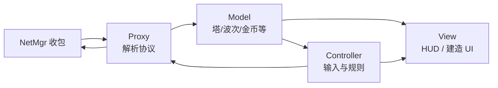

# 框架设计构思

本文档描述 **vFramework** 的分层架构、目录约定、模块职责与关键数据流。产品目标见 [ProjectGoals.md](./ProjectGoals.md)。

---

## 1. 设计原则

1. **分层依赖单向**：逻辑层 → 全局系统层 → 基础架构层；禁止反向引用。
2. **依赖下沉**：第三方库（UniTask、Addressables、Protobuf 等）仅在底层引用，通过 **Interface + Impt（实现/适配）** 向上暴露能力。
3. **Manager 注册式单例**：全局系统由 **GameRoot** 统一 `Create` / `Init` / `Update` / `Destroy`，禁止各处懒加载 `Instance`。
4. **逻辑与表现分离**：业务层采用 **MVC + Proxy**；网络数据只进 Proxy，Model 变更再通知 Controller / View。
5. **资源用逻辑地址**：运行时以 `location` / `address` 加载，不写 `Assets/...` 磁盘路径。

---

## 2. 三层架构总览



| 层级 | 程序集（规划） | 职责 |
|------|----------------|------|
| **BaseFramework** | `BaseFramework` | 与具体玩法无关的基础设施：事件、FSM 内核、网络编解码、序列化、日志、GameRoot 入口 |
| **BaseLayer** | `BaseLayer` | 可复用的全局 Manager：资源、场景、池、UI、音频、网络会话等 |
| **HotUpdateLayer** | `HotUpdate` | 塔防业务：流程、Proxy、Model、Controller、View |

---

## 3. 目录结构（当前约定）

```text
Assets/vFramework/
├── Docs/                          # 项目与框架文档
├── BaseFramework/                 # 基础架构层
│   ├── GameRoot/                  # 启动入口 MonoBehaviour
│   ├── BaseEventSys/              # 事件总线（Interface / Impt）
│   ├── BaseAssetSys/              # AB 打包与加载（原 ABSystem_Beta）
│   ├── BaseFSM/                   # 状态机内核
│   ├── BaseNetwork/               # 传输、包结构、编解码
│   ├── BaseSerialization/         # 序列化抽象
│   └── Log/                       # 日志
│
├── BaseLayer/                     # 全局系统层
│   ├── AssetLayer/                # 资源域文档与测试夹具（学习指南、ABSystemTester 等）
│   ├── TimeLayer/
│   ├── UI/
│   ├── Audio/
│   ├── Timer/
│   └── Save/
│
└── HotUpdateLayer/                # 业务逻辑层（热更）
    ├── Core/                      # AppContext, IProxy, IController
    ├── Model/
    ├── Proxy/
    ├── Controller/
    ├── View/
    └── GameFlow/
```

> **说明**：`BaseAssetSys` 承载当前 AB 打包/加载实现；`BaseLayer/AssetLayer` 保留学习文档与测试夹具。资源域 Manager（`ResMgr` / `SceneMgr` / `ObjPoolMgr`）接口与实现目录规划中，逐步与 `BaseAssetSys` 对齐。

---

## 4. BaseFramework 模块说明

### 4.1 BaseEventSys

- 类型安全事件总线：`Subscribe` / `Unsubscribe` / `Publish`。
- 事件体实现 `IGameEvent`，推荐 `struct` + 轻量字段，避免长期持有 `UnityEngine.Object`。
- 框架级、跨层协作事件使用；高频局内战斗消息优先走 Proxy / 直接调用，避免事件风暴。

### 4.2 BaseFSM

- 通用状态机节点，供 **GameFlow**（启动、Patch、登录、进战斗）使用。
- 不含塔防具体状态，仅提供 `Enter` / `Update` / `Exit` 等机制。

### 4.3 BaseNetwork

- `INetPackage`、编解码、RingBuffer、TCP/WebSocket 适配。
- **不含**塔、波次等业务协议；业务协议在 HotUpdateLayer 的 Proxy 中注册。

### 4.4 异步约定

- 底层以 **UniTask** 为主；`RunOnThreadPool`、Delay 等通过 BaseFramework 工具封装，上层避免散落第三方 API。
- Unity API 必须在主线程；IO 与纯计算可在线程池，结果回主线程再应用。

详见 `BaseFramework/BaseEventSys/README.md`。

---

## 5. BaseLayer 模块说明

### 5.1 GameRoot 与模块中心

**GameRoot**（唯一 Bootstrap Scene 入口）负责：

```text
Initialize 模块中心
  → CreateModule（按 Priority）
  → InitAllAsync
  → UpdateAll（每帧）
  → DestroyAll（逆序，OnDestroy）
```

各 Manager 实现 `IGameModule`（或等价接口），继承 `SingletonInstance<T>`，通过注册中心获取，**禁止**在 `get` 中隐式 `new`。

### 5.2 AssetLayer（资源域）

同一资源管线下的三个 Manager，**目录聚合、运行时独立**：

| Manager | 接口 | 职责 |
|---------|------|------|
| **ResMgr** | `IResMgr` | `LoadAssetAsync` / `Release` / 引用计数 |
| **SceneMgr** | `ISceneMgr` | 单场景 / Additive 加载与卸载、Loading 流程 |
| **ObjPoolMgr** | `IObjPoolMgr` | Spawn / Despawn（敌人、子弹、特效等） |

关系：



- 底层加载通过 **IResLoader** 适配器实现，当前默认链为 **Addressables → Resources**（`CompositeResLoader`）；Adapter 仅在 AssetLayer `Impt/Loader` 中引用。
- 逻辑地址支持前缀：`addr://`（Addressables）、`res://`（Resources）；后续可扩展 `AssetBundleResLoader` 等实现。
- 逻辑层调用：`ResMgr.LoadAsync("location")` / `SceneMgr.LoadSingleAsync("scene_battle")`，不直接调用 `Addressables.LoadAssetAsync` 或 `Resources.Load`。

**Init 顺序建议**：`ResMgr`（Priority 高）→ `SceneMgr` → `ObjPoolMgr`。

### 5.3 其他全局系统（规划）

| 模块 | 职责 |
|------|------|
| **NetMgr** | 连接、心跳、按 msgId 分发字节流 |
| **UIMgr** | 窗口栈、层级；加载 Prefab 委托 ResMgr |
| **AudioMgr** | BGM/SFX；加载 Clip 委托 ResMgr |
| **TimerMgr** | 延迟与重复调度 |
| **SaveMgr** | 本地存档 |

---

## 6. HotUpdateLayer：MVC + Proxy

面向塔防业务，采用 **PureMVC 风格** 的变体：



### 6.1 角色职责

| 角色 | 职责 | 示例 |
|------|------|------|
| **Model** | 纯数据，由 Proxy 写入 | `BattleModel`、`PlayerModel` |
| **Proxy** | 网络上下行、更新 Model、注册 msgId | `BattleProxy`、`PlayerProxy` |
| **Controller** | 点击建造、波次逻辑；调 `GetProxy<T>()` 发请求 | `BattleController` |
| **View** | UI 绑定 Model 或订阅事件刷新 | `BattleHUDView` |

### 6.2 AppContext（注册中心）

- `RegisterProxy<T>` / `GetProxy<T>`
- `RegisterController<T>` / `GetController<T>`
- `Shutdown` 时逆序 `OnRemove`，Proxy 注销网络 handler

**LogicBootstrap**（热更完成后调用）集中注册，GameRoot 只触发一次 `LogicBootstrap.Initialize()`。

### 6.3 约定

- Model **仅 Proxy 写**；Controller 可读，写操作走 Proxy 方法。
- Proxy 更新 Model 后，通过 **GameEventBus** 或 Model 事件通知 Controller，避免 Proxy 直接调用 Controller。
- View 不持有 Proxy；玩家操作 → Controller → Proxy → NetMgr。

---

## 7. 网络与联机数据流

**下行（服务器 → 客户端）**

```text
NetMgr.OnMessage(msgId, bytes)
  → BattleProxy.OnWaveStart(data)
  → BattleModel.SetWave(n)
  → Publish WaveStartedEvent
  → BattleController / BattleHUDView 刷新
```

**上行（客户端 → 服务器）**

```text
View 点击建造
  → BattleController.OnBuildTower(slotId, towerId)
  → BattleProxy.RequestBuildTower(...)
  → NetMgr.Send(msgId, payload)
```

塔防同步字段（示例）：波次 ID、实体 ID、塔位占用、金币、敌人路径进度等——协议与 Proxy 同模块维护，NetMgr 保持通用。

---

## 8. 程序集与热更边界

| 程序集 | 内容 | 引用 |
|--------|------|------|
| `BaseFramework` | 架构层 | UniTask、Unity 核心 |
| `BaseLayer` | 全局 Manager | BaseFramework、Addressables 等 |
| `HotUpdate` | 业务逻辑 | BaseLayer、BaseFramework |

- AOT 侧：GameRoot、Patch、HybridCLR 加载（若使用）。
- 热更侧：Proxy、Controller、塔防玩法、GameFlow 节点。

---

## 9. 命名与代码约定

- 命名空间（规划）：`BaseFramework.*`、`BaseLayer.*`、`HotUpdate.*`
- 接口：`I` 前缀，置于各模块 `InterFace/` 目录
- 实现：置于 `Impt/` 目录
- 静态无状态工具（如 `GameEventBus`）可不走单例注册，但与 Manager 职责区分清楚

---

## 10. 实施优先级（P0 → P1）

### P0 — 框架骨架

1. GameRoot + 模块注册中心  
2. BaseEventSys（已有）  
3. AssetLayer 三 Manager 接口 + Resources/Addressables 最小 Adapter  
4. NetMgr 消息分发  
5. HotUpdate：AppContext + 示例 Proxy/Controller  

### P1 — 塔防联机准备

6. GameFlow FSM（Patch → Login → Battle）  
7. UIMgr 最小窗口栈  
8. ObjPoolMgr 与 ResMgr 打通  
9. 第一条战斗同步协议端到端  

---

## 相关文档

- [项目目标](./ProjectGoals.md)
- [BaseEventSys 异步与事件说明](../BaseFramework/BaseEventSys/README.md)
